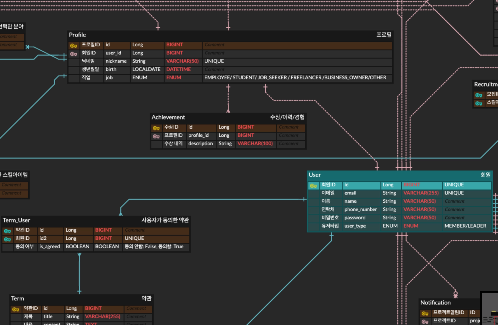
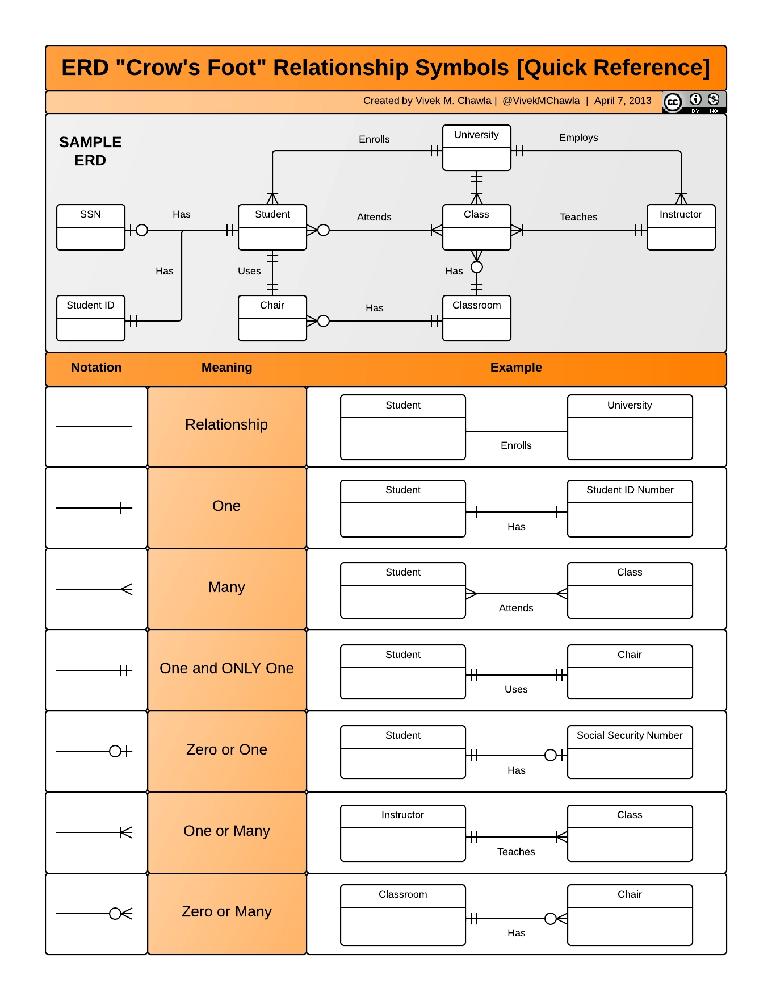

## PK(Primary Key): 기본키, 주식별자

- **테이블 내의 모든 데이터(행)을 유일하게 식별해주는 속성**이다.
- **NOT NULL + UNIQUE** 속성을 합쳐놓은 것 (중복, null 불가)

## FK(Foreign Key): 외래키, 외부식별자

- **다른 테이블의 PK와 연결되어 테이블간 관계를 나타내는 속성**이다.
- 참조하는 테이블에서 FK를 선언한다. (일대다 관계에서 ‘**다**’쪽이 참조하는 테이블)
- **FK가 중복이 불가능한 경우:** **1:1 관계**
    - User - UserProfile 과 같이 1:1 관계일 경우에는 FK에 UNIQUE제약을 걸어 중복이 안되도록 해야함.
    - 자주 안쓰는 칼럼이나 보안상 민감한 부분과 같이 선택적으로 칼럼을 분리할 경우 1:1 관계로 설정한다고 한다.
- **FK가 NULL이 허용되지 않는 경우**
    - 게시물 - 좋아요 관계에서 좋아요 테이블에는 무조건 게시물에 관한 정보가 있어야함. 이럴 경우 NOT NULL 제약을 걸어야한다.
    - 하지만 쿠폰 - 주문 관계 같이 주문 테이블에 무조건 쿠폰이 있을 필요는 없기 때문에 이럴 경우에는 NULL을 허용하도록 한다.

→ PK와 다르게 중복과 NULL 허용 여부는 설계에 따라 달라진다.

### Super key, Candidate key

- Super key: 테이블 내의 모든 데이터를 식별할 수 있는 키
    - {학번}
    - {학번, 이름}
    - {학번, 이름, 학과}
- Candidate key: super key 중에서 불필요한 속성을 뺀 최소 키 (최소성 + 유일성)
    - {학번}
    - {학번, 이름} → 이름이 불필요하므로 candidate X
- **PK ⊂ Candidate Key ⊂ Super Key**

## ERD: Entity Relationship Diagram

- **데이터베이스에서 엔티티(테이블) 들이 서로 어떤 관계를 맺고 있는지 시각적으로 나타낸 Diagram**
- **Entity, Attribute(속성), Relationship(관계)** 으로 구성된다.

### ERD 관계 표기법

- **식별관계(자식이 FK를 PK로) vs 비식별관계**
- 식별관계가 비식별관계보다 더 강한 관계를 나타내기 때문에 **실선**으로 표기하고, 비식별관계는 보다 약한 관계를 표현하기 위해 **점선**으로 표기한다.



**파란색 → 식별관계, 분홍색 → 비식별관계**

### ERD Cardinality 종류



- One-to-One (1:1 관계)
- One-to-Many (1:N 관계)
- Many-to-Many (M:N 관계)
    - 주로 Mapping 테이블을 두고 다대다 관계(M:N)를 일대다 관계(1:N) 두개를 만들어서 표현한다.

## DB에서의 연관관계

- 관계형 데이터베이스는 테이블 간 서로 관계를 맺을 수 있다.
- **FK(외래키)를 통해 논리적으로 연관이 있는 두 테이블 사이의 연결**을 설정할 수 있다.

### 연관 관계의 종류와 DDL예시

- 1:1 관계 (일대일)
    
    ```sql
    CREATE TABLE User (
        user_id BIGINT PRIMARY KEY
    );
    
    CREATE TABLE UserProfile (
        profile_id BIGINT PRIMARY KEY,
        user_id BIGINT UNIQUE, -- 1:1 을 나타냄
        FOREIGN KEY (user_id) REFERENCES User(user_id)
    );
    ```
    
- 1:N 관계 (일대다)
    
    ```sql
    CREATE TABLE Member (
        member_id BIGINT PRIMARY KEY
    );
    
    CREATE TABLE Orders (
        order_id BIGINT PRIMARY KEY,
        member_id BIGINT, -- 일대일 관계와 다르게 unique제약이 없음.
        FOREIGN KEY (member_id) REFERENCES Member(member_id)
    );
    ```
    
- N:M 관계 (다대다)
    
    ```sql
    CREATE TABLE Enrollment (
        student_id BIGINT,
        course_id BIGINT,
        PRIMARY KEY (student_id, course_id),
        FOREIGN KEY (student_id) REFERENCES Student(student_id),
        FOREIGN KEY (course_id) REFERENCES Course(course_id)
    );
    ```

## 데이터 베이스 정규화(Normalization)

- **데이터의 중복을 최소화**하고 **이상현상(Anomaly**)**을 방지**하기 위해 테이블을 **분해**하는 과정
- 데이터의 일관성과 무결성을 목적으로 한다.

### 장점

- 정규화가 잘 된 데이터베이스에서는 **기존 구조의 변경없이 확장에 자유롭다.**
- 유지보수에 용이하다.
- 데이터의 일관성이 유지된다.

### 단점

- 테이블을 많이 분해하는 과정에서 JOIN연산이 늘어나 **성능 저하가 발생할 수 있다.**

### 함수 종속성(Functional Dependency)

- A → B : A가 B를 결정한다.
- 정규화는 함수 종속성(FD)를 기준으로 테이블을 분해하는 과정이다.

## ⭐️ 정규화의 단계

### INF (제1 정규형)

- 테이블의 모든 속성은 **원자값**을 가져야 한다.
- 하나의 컬럼에 여러 값을 저장 불가능

| 학번 | 이름	 | 수강 과목 |
| --- | --- | --- |
| 1 | 여니 | 자료구조 |
| 2 | 그린 | DB, OS |
| 3 | 윤샘 | 네트워크 |

→ DB, OS는 원자값이 아님

| 학번 | 이름 | 수강 과목 |
| --- | --- | --- |
| 1 | 여니 | 자료구조 |
| 2 | 그린 | DB |
| 2 | 그린 | OS |
| 3 | 윤샘 | 네트워크 |

### 2NF (제2 정규형)

- 제1 정규화를 지키고 있는 테이블에 대한 부분 함수 종속성을 제거해야한다.
- 기본키의 일부에만 종속되는 속성 제거

| 학번 | 이름 | 수강 과목 | 교수 |
| --- | --- | --- | --- |
| 1 | 여니 | 자료구조 | 김영호 |
| 2 | 그린 | DB | 김정은 |
| 2 | 그린 | OS | 송민석 |
| 3 | 윤샘 | 네트워크 | 노희준 |

**복합 PK (학번 + 과목)**

- 학번 → 학생이름
- 과목 → 교수

→ 학생이름과 교수는 PK의 일부에만 종속됨. (PK의 일부에 의해 결정됨) → **제2 정규화 위반**

| 학번 | 이름 |
| --- | --- |
| 1 | 여니 |
| 2 | 그린 |
| 3 | 윤샘 |

| 과목 | 교수 |
| --- | --- |
| 자료구조 | 김영호 |
| DB | 김정은 |
| OS | 송민석 |
| 네트워크 | 노희준 |

| 학번 | 수강 과목 |
| --- | --- |
| 1 | 자료구조 |
| 2 | DB |
| 2 | OS |
| 3 | 네트워크 |

### 3NF (제3 정규형)

- 제2 정규화를 지키고 있는 테이블에 대한 이행 함수 중속성을 제거해야한다.
- 기본 키가 아닌 속성이 다른 일반 속성에 종속되는 경우 제거
- 종속되는 속성이 후보키에 포함된 속성이면 허용된다.

| 학번 | 학과 | 학과 전화번호 |
| --- | --- | --- |
| 1 | 컴퓨터공학과 | 032-123-1234 |
| 2 | 인공지능공학과 | 032-132-4321 |
| 3 | 전자전기공학부 | 032-213-2134 |

학번(PK) → 학과, **학과 → 학과 전화번호 : 기본 키가 아닌 속성이 다른 일반 속성에 종속됨.**

| 학번 | 학과 |
| --- | --- |
| 1 | 컴퓨터공학과 |
| 2 | 인공지능공학과 |
| 3 | 전자전기공학부 |

| 학과 | 학과 전화번호 |
| --- | --- |
| 컴퓨터공학과 | 032-123-1234 |
| 인공지능공학과 | 032-132-4321 |
| 전자전기공학부 | 032-213-2134 |

### BCNF (**Boyce-codd Normal Form)**

- 모든 결정자는 **후보키** 이어야한다.
- 더 강화된 3NF버전

```
advisor(s_ID, i_ID, dept_name) -- **지도교수**

1. (s_ID, dept_name) → i_ID   (학생 + 학과 → 교수)
2. i_ID → dept_name          (교수 → 학과)

(s_ID, dept_name) -- **후보키**
-> 2번 FD를 적용하면 BCNF위반.
-> dept_name이 후보키에 속한 속성이기 때문에 3NF는 위반 아님.
```

- **R1(s_ID, i_ID), R2(i_ID, dept_name)**
    - 이렇게 나누면 BCNF를 만족하게 할 수 있음. 하지만 JOIN을 하지 않으면 FD를 확인할 수 없는 문제(Dependency Preservation)가 있음 → 따라서 **중복을 약간 허용하면서 3NF따를지, BCNF를 선택할지는 설계하기 나름**이다.

## 반정규화 (Denormalization)

- **정규화를 통해 분해된 테이블을 성능 향상을 위해 다시 결합하거나 중복을 허용하는 과정**
- JOIN으로 인해 성능저하가 예상될 때, 조회 성능을 향상시키기 위해 사용된다.

### 장점

- JOIN 이 감소되면서 조회 성능이 향상된다.
- 쿼리가 간단해진다.
- 대용량 조회에 유리하다.

### 단점

- 데이터의 중복이 증가한다.
- 데이터 일관성을 유지하기 어려울 수 있다.
- 저장 공간이 증가한다.
- 데이터 베이스 유연성이 저하된다. (확장에 불리)

## ⭐️ 반정규화 기법

### 테이블의 반정규화

| 분류 | 반정규화 기법 |
| --- | --- |
| 테이블 병합 |   • 1:1 관계 테이블 병합
  • 1:M 관계 테이블 병합
  • 슈퍼/서브 테이블 병합 |
| 테이블 분할 |   • 수직 분할
  • 수평 분할 |
| 테이블 추가 |   • 중복 테이블 추가
  • 통계 테이블 추가
  • 이력 테이블 추가
  • 부분 테이블 추가 |
- 1:1 테이블 병합 → JOIN제거 성능 향상
    
    ```
    User(id, name)
    UserProfile(user_id, address, phone)
    
    → User(id, name, address, phone)
    ```
    
- 테이블 추가 → 매번 SUM 쿼리를 실행 안해도됨.
    
    ```
    Order → 주문 테이블
    OrderSummary → 하루 총 주문 금액 저장
    ```
    

### 컬럼(속성)의 반정규화

| 분류 | 반정규화 기법 |
| --- | --- |
| 컬럼 추가 |   • 중복 컬럼 추가
  • 파생 컬럼 추가
  • 이력 테이블 컬럼 추가
  • PK에 의한 컬럼 추가
  • 응용 시스템 오작동을 위한 컬럼 추가 |
- 중복 컬럼 추가 → JOIN없이 바로 사용자 이름 조회 가능
    
    ```
    User(id, name)
    Order(user_id, user_name)
    ```
    
- 파생 컬럼 추가 → 주문 수(Order) COUNT안해도 바로 조회 가능
    
    ```
    User(order_count)
    ```

## DB에서의 상속관계

- 관계형 데이터베이스에는 객체 지향의 상속 개념이 존재하지 않는다.
- 대신, **Super-Type / Sub-Type** 관계로 표현
- **Super-Type / Sub-Type**
    - **Super-Type (부모)**: 공통 속성
    - **Sub-Type (자식)**: 개별 속성 + 부모 속성 상속

### ORM(Object Relational Mapping)의 역할

- **객체에서의 상속구조와 DB의 상속관계를 표현하는 방식이 다르기 때문에**, 매핑해주는 역할을 ORM이 한다.
- **객체 ↔ 테이블 구조 매핑**
- **JPA**: 자바 ORM표준 → Hibernate(구현체)
- JPA에서 상속을 표현하는 법 → `@Inheritance`
    - strategy = InheritanceType.JOINED
    - strategy = InheritanceType.SINGLE_TABLE
    - strategy = InheritanceType.TABLE_PER_CLASS

## 🧩 테이블로 상속 관계를 구현하는 방식

### 1️⃣ 단일 테이블 전략(SINGLE_TABLE)

- 각각의 객체를 테이블 하나로 만들어서 하나의 테이블만 사용한다.
- 자식들을 구분하기 위해 구분 컬럼을 사용해야한다.
- 조인이 발생하지 않기 때문에 조회가 빠르다.
- 모든 자식 타입의 컬럼을 가지고 있기 때문에, 쓰이지 않는 컬럼은 null로 설정해야한다.(nullable = True)

```java
@Entity
@Inheritance(strategy = InheritanceType.SINGLE_TABLE)
@DiscriminatorColumn(name = "dtype")
public abstract class User {
    @Id @GeneratedValue
    private Long id;
}
```

```java
@Entity
@DiscriminatorValue("ADMIN")
public class Admin extends User {
    private String adminCode;
}

@Entity
@DiscriminatorValue("CUSTOMER")
public class Customer extends User {
    private String grade;
}
```

**→ User(id, dtype, adminCode, grade)**

- `@DiscriminatorColumn(name = "dtype")` → 자식 타입 구분 컬럼 이름 지정
- `@DiscriminatorValue("ADMIN")`, `@DiscriminatorValue("CUSTOMER")` → `dtype`컬럼에 들어가는 값으로자식 테이블에 설정함으로써 자식테이블을 구분할 수 있음

### 2️⃣ 조인 전략(JOINED)

- 각각의 객체를 모두 테이블로 만들고, 조회할 때 조인을 사용한다.
- 자식 테이블은 부모 테이블의 PK를 FK로 갖는다.
- 조인이 발생하는 경우 단일 테이블 전략보다 조회 성능이 안좋을 수 있다.
- 데이터를 삽입할 때, 부모, 자식 각각 2번의 INSERT가 필요하다.

```java
@Entity
@Inheritance(strategy = InheritanceType.JOINED)
@DiscriminatorColumn(name = "dtype")
public abstract class User {
    @Id @GeneratedValue
    private Long id;
}
```

```java
@Entity
@DiscriminatorValue("ADMIN")
@PrimaryKeyJoinColumn(name = "user_id")
public class Admin extends User {
    private String adminCode;
}
```

**→ User(id, dtype), Admin(user_id, adminCode)**

- `@PrimaryKeyJoinColumn` → 자식 테이블 PK이름 지정 및 부모 PK 참조하도록 연결 (조인 가능하도록)

### 3️⃣ 클래스별 테이블 전략(TABLE_PER_CLASS)

- 자식 엔티티마다 하나의 테이블을 만든다.
- 자식 엔티티에 **부모 속성을 모두 추가**해서 중복으로 저장한다.
- 자식 엔티티 간 연관된 데이터를 조회하기 어렵다.
- 일반적으로 잘 쓰이지 않는다.

```java
@Entity
@Inheritance(strategy = InheritanceType.TABLE_PER_CLASS)
public abstract class User {
    @Id @GeneratedValue
    private Long id;
    private String name;
}
```

```java
@Entity
public class Admin extends User {
    private String adminCode;
}
```

**→ Admin(id, name, adminCode)**

## 분류(enum) (vs 상속)

- **분류**: 엔티티를 별도로 상속관계로 나누지 않고, 타입 컬럼(주로 Enum) 으로 구분하는 방식
- DB에서 별도로 테이블로 관리하지 않고 하나의 테이블로 관리한다.
- 단순히 데이터를 분류하는 개념이며, 로직은 if / else 와 같은 분기문으로 처리한다.
- 구조가 단순하고 실무에서 가장 많이 사용하는 방식이지만, 타입별로 행동이 많이 다른 경우에는 로직이 복잡해 질 수 있다.
    
    ```java
    @Entity
    public class User {
        @Id @GeneratedValue
        private Long id;
    
        @Enumerated(EnumType.STRING)
        private UserType type; // ADMIN, CUSTOMER
    }
    ```
    
- **상속:** 객체 지향의 상속 구조를 활용하여 타입을 구분하는 방식
- 단순 분류가 아니라, 타입 별로 다른 행위를 가진다.
- 객체 지향의 특성인 **다형성**을 활용할 수 있다.
- 하지만 테이블 구조가 복잡하고 성능 이슈가 생기며 설계 난이도가 높은 편이다. 물론 실무에서도 잘 사용하지 않는다고한다.

## 데이터베이스 인덱스(Index, 색인)

- **추가적인 쓰기 작업과 저장 공간을 활용하여 데이터베이스 테이블의 검색 속도를 향상시키기 위한 자료구조**이다.
- DBMS에서 특정 컬럼으로 인덱스를 생성해 테이블을 전부 스캔하지 않고 인덱스를 활용해서 빠르게 데이터에 접근할 수 있다.
- **인덱스는 읽기 작업을 빠르게 유지하기 위해 INSERT, UPDATE, DELETE의 성능을 희생한다.** 쓰기 작업이 조금 느리더라도 일반적인 환경에서 읽기 작업의 비율이 더 높기 때문에 인덱스를 사용한다. (8:2, 9:1 비율로 읽기 작업이 더 많다.)
- 인덱스를 먼저 스캔해 원하는 레코드의 위치를 찾고, 찾은 위치로 테이블에서 실제 데이터의 레코드를 불러오는 방식이다.

### 인덱스의 구조

- 여러 DBMS에서 기본적으로 **B-Tree구조**나 그의 변형인 **B+Tree**나 **B*-Tree** 등을 사용한다.
    - B-Tree는 **루트노드, 브랜치노드, 리프노드**로 구성되어있다.
    
    
    
- 인덱스는 페이지 단위로 저장되며, **인덱스 키를 바탕으로 항상 정렬된 상태를 유지**한다.
- 정렬된 인덱스 키를 따라서 리프 노드에 도달하면 원하는 값을 찾을 수 있다.
    - **MySQL**는 실제 데이터가 디스크에 PK로 정렬된 채 저장되기 때문에 **실제 데이터 테이블 = 클러스터드 인덱스의 리프노드** 라고 보기도 한다. **Secondary Index**는 PK가 아닌 값으로 인덱스를 생성한 것을 말하며, 리프 노드에 **(인덱스 키, PK)**가 저장된다.
    - **PostgreSQL**는 리프노드에 **(키 값, TID)**를 저장한다. 여기서 TID는 **page번호와 offset**을 저장해 실제 레코드에 빠르게 접근 가능하게 해준다.

## 🧩 인덱스 스캔 방식

### 인덱스 레인지 스캔

- **범위가 결정된 인덱스를 읽는 방식**
    1. 인덱스의 조건을 만족하는 값이 저장된 위치를 찾는다. (’Lee’)
    2. 시작 위치부터 필요한 만큼 인덱스를 순서대로 읽는다.
    3. 읽어들인 인덱스와 PK를 이용해 최종 레코드를 읽어온다.

```sql
select * from student where name between 'Lee' and 'Han'; -- 범위 스캔
```

- 정해진 범위를 접근하면 되기 때문에 다른 방식들 보다 빠르다.
- 일반적으로 **“인덱스를 탄다. = 인덱스 레인지 스캔으로 데이터 조회”** 를 의미한다.
- 쿼리가 인덱스에 저장되어 있는 값(PK)을 필요로 한다면 최종 레코드를 불러오는 추가적인 I/O작업을 할 필요가 없다. 이를 **커버링 인덱스**라고 한다. → 랜덤 I/O 작업을 줄일 수 있어서 성능이 뛰어남.
- 만약 테이블의 전체 데이터에서 20%~25% 이상의 데이터가 필요하다면, 인덱스 스캔보다 풀테이블 스캔이 성능이 더 좋을 수 있다.

### 인덱스 풀 스캔

- **처음 부터 끝까지 페이지를 이동하며 모든 인덱스를 읽는 방식**
- 쿼리가 인덱스나 PK만 필요로 한다면 해당 방식이 사용된다. 하지만 그 외 컬럼이 필요하다면 이 방식은 사용되지 않는다.
- 인덱스 풀 스캔은 테이블 풀 스캔보다 하나의 I/O로 가지고 올 수 있는 데이터가 더 많아 조금 더 효율적이지만, 실제 데이터 접근이 필요한 경우 추가 비용이 발생할 수 있다.
- 하지만, 인덱스 풀 스캔을 위해 인덱스를 생성하는 것은 권장되지 않으며, 인덱스 풀 스캔은 일반적으로 “인덱스를 사용한다.”고 하지 않는다.

### 루스 인덱스 스캔

- **중간에 불필요한 인덱스를 무시하고 넘어가며 인덱스를 듬성듬성 읽는 방식**
- 일반적으로 GROUP BY나 MIN(), MAX()와 같은 집합 함수를 사용하는 쿼리를 최적화할 때 사용된다.

```sql
-- (dept_name, score)로 인덱스가 생성되어있는 상황
select dept_name, MIN(score)
from student
where dept_name between 'C' and 'E'
group by dept_name;
```

- score는 dept_name에 의존하여 정렬되므로, dept_name 그룹 별로 가장 처음의 score값만 읽으면 된다.
- 따라서 첫 값만 읽고 같은 dept_name은 건너 뛰며 다음으로 넘어가며 스캔한다.

### 인덱스 스킵 스캔

- 인덱스의 뒷 컬럼만으로 검색하는 경우에 옵티마이저가 자동으로 쿼리를 최적화하여 인덱스를 타도록 하는 읽기 방식이다.

```sql
select gender, birth_date from student where dirth_date >= '2001-01-01';
```

- (gender, birth_date)로 인덱스가 생성되어있는 상황
    - 기존에는 gender가 WHERE 절에 비교 조건으로 반드시 있어야 했지만, MySQL 8.0부터는 옵티마이저가 쿼리를 최적화 해줌
    
    ```sql
    select gender, birth_date 
    from student 
    where gender = 'M' and birth_date >= '2001-01-01'
    
    select gender, birth_date 
    from student 
    where gender = 'F' and birth_date >= '2001-01-01'
    ```
    
    - 인덱스 선행 컬럼(gender)의 카디널리티가 낮아야 한다. (유니크한 값이 적어야 함)
    - 인덱스의 선행 컬럼은 WHERE절에 없으며, 조회되는 컬럼(gender, birth_date)는 인덱스 만으로 처리 가능해야한다.(커버링 인덱스)

### INSERT, UPDATE, DELETE가 인덱스에 미치는 영향

- INSERT
    - 레코드가 추가되면 인덱스도 같이 추가되어야 하며, 인덱스는 정렬 상태를 유지해야 하기 때문에 적절한 위치를 탐색하는 과정이 필요하다.
    - 추가 비용은 약 1.5 정도로 가정한다. (인덱스가 3개가 있다면 작업 비용은 4.5가 늘어남)
    - 레코드를 추가하다가 페이지가 꽉 찼다면 추가적으로 새로운 리프 노드를 분리하는 작업때문에 추가적인 I/O 가 발생할 수 있다.
- UPDATE
    - 레코드 수정은 레코드를 삭제 및 추가하는 과정과 같다.
    - 인덱스와 PK가 수정될 때에는 테이블 뿐만 아니라 인덱스에 추가 작업이 반드시 필요하기 때문에 작업 비용이 많이 든다.
- DELETE
    - 레코드를 삭제할 때에는 리프 노드에 삭제 마킹을 하거나 공간을 재활용할 수 있다.
    - 레코드를 삭제하는 작업은 PK나 인덱스가 사용되는 쿼리라면 이를 활용해서 처리한다.

### 인덱스 종류

| 종류 | 설명 |
| --- | --- |
| 순서 인덱스 (Ordered Index) |   • 데이터가 정렬된 순서로 생성되는 인덱스 |
| 해시 인덱스 (Hash Index) |   • 해시 함수에 의해 직접 데이터에 키 값으로 접근하는 인덱스
  • 데이터 접근 비용이 균일하며 데이터 양에 무관함. |
| 비트맵 인덱스 (Bitmap Index) |   • 각 컬럼에 적은 개수 값이 저장된 경우 선택하는 인덱스
  • 수정 변경이 적을 경우 유용함. |
| 함수 기반 인덱스 (Functional Index) |   • 수식이나 함수를 적용하여 만든 인덱스 |
| 단일 인덱스 (Singled Index) |   • 하나의 컬럼으로만 구성한 인덱스
  • 주 사용 컬럼이 하나일 경우 사용 |
| 결합 인덱스 (Concateenated Index) |   • 두 개 이상의 컬럼으로 구성한 인덱스
  • WHERE 조건으로 사용하는 빈도가 높은 경우 사용 |
| 클러스터드 인덱스 (Clustered Index) |   • 기본 키(PK) 기준으로 레코드를 묶어서 저장하는 인덱스
  • 저장 데이터의 물리적 순서에 따라 인덱스가 생성됨.
  • 특정 범위 검색 시 유리함. |