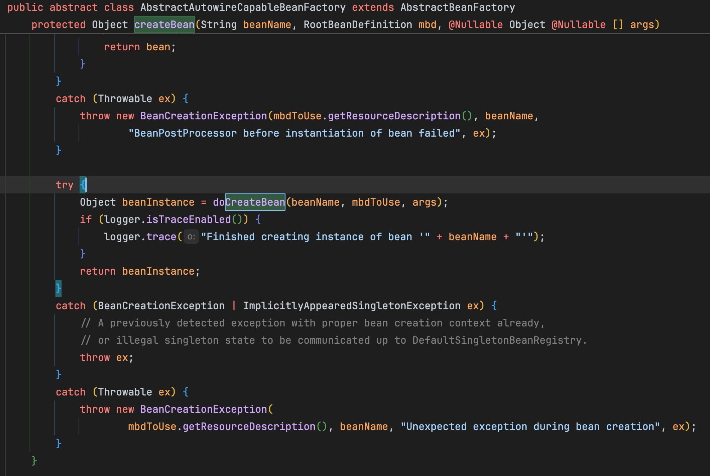

## AbstractAutowireCapableBeanFactory
<aside>

Spring 컨테이너 안에서 Bean을 생성 및 설정, 초기화를 책임지는 추상 클래스이다.

</aside>

- 빈과 빈 사이의 의존성을 연결해준다.
- `createBean()`의 `doCreateBean()`함수가 실행되면서 객체가 생성되고 메모리에 올라간다.

## BeanPostProcessor

<aside>

Bean이 생성된 직후, 사용되기 전에 끼어들어서 가공할 수 있는 인터페이스이다.

</aside>

- AOP 프록시 생성, 로깅 추가 등이 이 인터페이스에서 일어난다.

## AutowiredAnnotationBeanPostProcessor

BeanPostProcessor의 구현체로, @Autowired 어노테이션이 존재하는 필드/생성자를 자동으로 찾아서 주입해주는 역할을 한다.