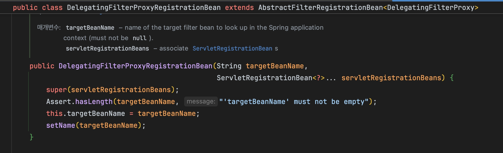
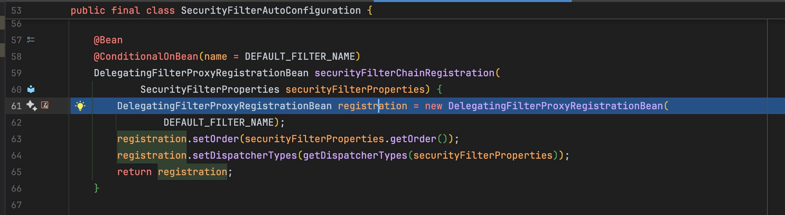
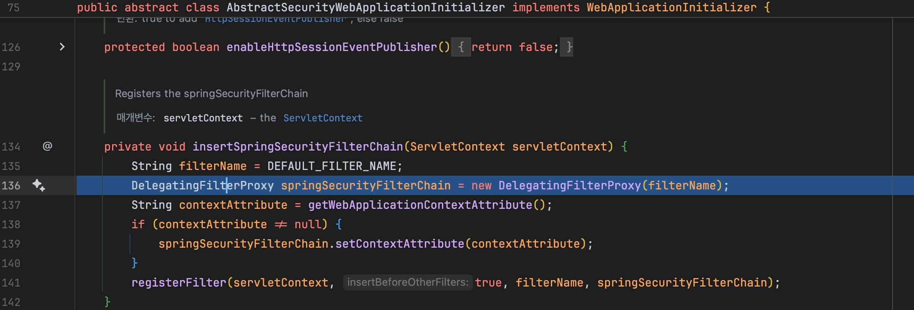
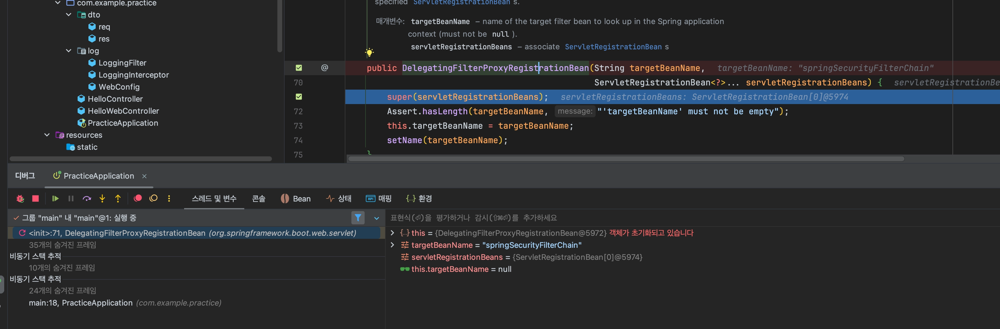

## DelegatingFilterProxyRegistrationBean
DelegatingFilterProxy를 생성해 서블릿 컨테이너에 등록해주는 클래스
Spring Boot환경에서 작동하는 방식이다.

## SecurityFilterAutoConfiguration
DelegatingFilterProxyRegistrationBean객체를 생성하고 빈으로 등록하면서 DelegatingFilterProxy가 등록되도록 만드는 설정 클래스

## AbstractSecurityWebApplicationInitializer
`DelegatingFilterProxy`를 생성하고 서블릿 컨텍스트의 Filter Chain에 등록한다.

- 전통적인 Spring MVC 환경에서 작동하는 방식이다.
- Spring Boot 환경에서 실행하면 실행되지 않는 코드이다.

→ 실제로 DelegatingFilterProxyRegistrationBean만 실행된다.
## FilterChainProxy의 VirtualFilterChain
<aside>

Security 필터들을 순서대로 실행하기 위한 내부 전용 가상 체인

</aside>

- Security Filter들을 실행하기 위해서는 Spring Context에 위임해야한다.
- Spring Context가 `DelegatingFilterProxy`에 의해 위임받으면, 실제로 톰캣의 필터체인인 `ApplicationFilterChain`이 아닌 `VirtualFilterChain`을 기반으로 Security필터들이 실행된다.