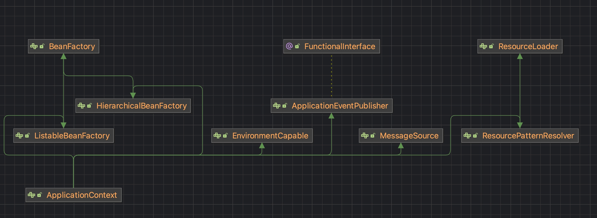
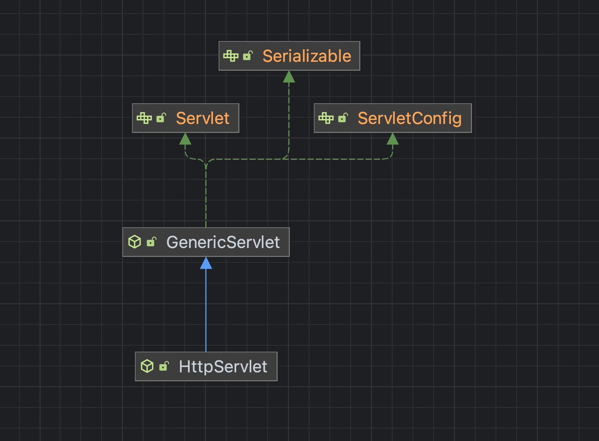
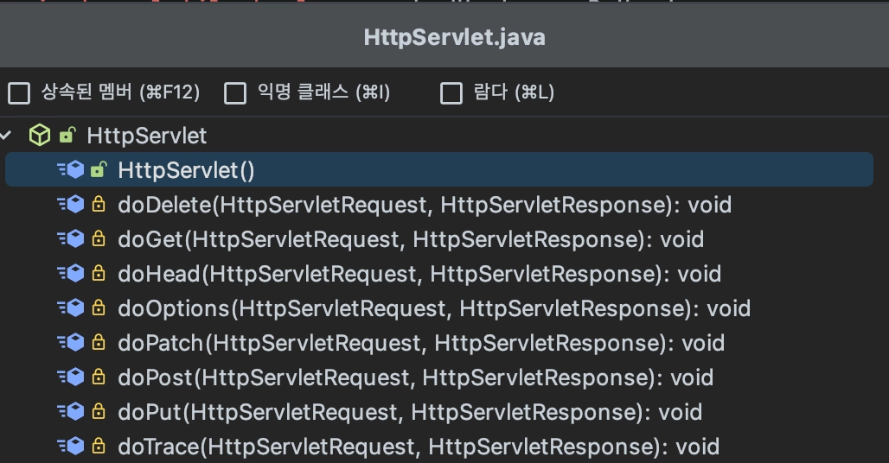
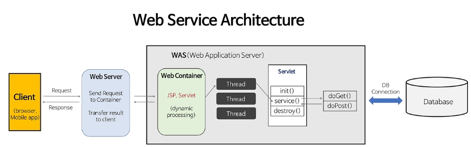
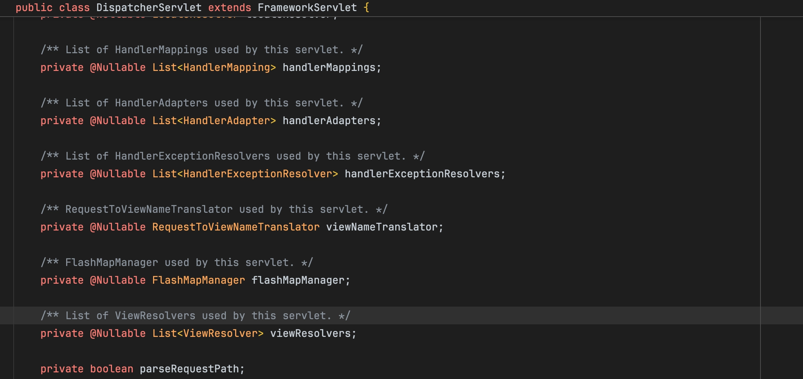
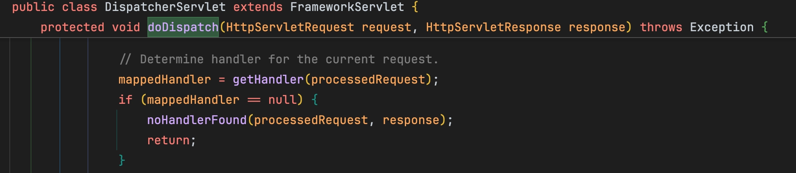
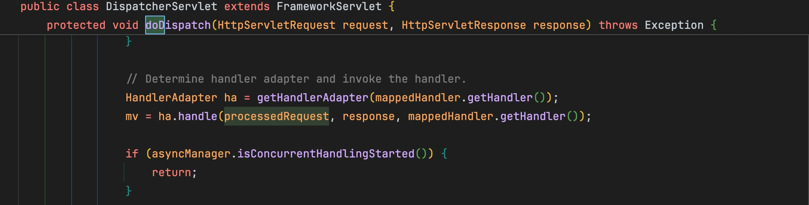
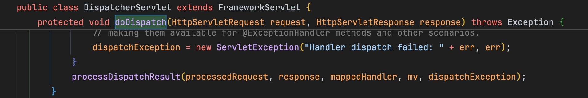

## 객체 지향 설계의 5원칙 : SOLID

### 1️⃣ SRP(Single Responsibility Principle): 단일 책임 원칙

- **클래스가 하나의 책임만 가져야 하며, 클래스가 변경되어야 하는 이유는 오직 하나여야 한다는 원칙**
- 여기서 ‘책임’이란, 하나의 기능을 말한다.
- 만약 하나의 클래스에 여러 책임(기능)을 가지고 있다면, 기능 변경이 일어났을 때 수정해야할 코드가 많아진다.

```java
// SRP 위반 예제
class Student {
    private String name;
    private String department;

    public Student(String name, String department) {
        this.name = name;
        this.deparatment = department;
    }

    public void goClass() {
        // 수업 듣는 로직
    }

    public void generateReport() {
        // 보고서 생성 로직
    }
}
```

- 위의 코드에서 Student 클래스는 수업을 듣는 클래스와, 보고서 생성 로직 두 가지의 책임을 가지고 있다. 따라서 SRP를 위반하는 예제이다.

```java
// SRP 준수 예제
class Student {
		private String name;
		private String department;
		
		public Student(String name, String department) {
				this.name = name;
				this.department = department;
		}
		
		public void goClass() {
				// 수업 듣는 로직
		}
}

class ReportGenerator {
		public void generateReport() {
				// 보고서 생성 로직
		}
}
```

- 위의 코드에서는 Student 클래스는 수업을 듣는 것과 관련된 책임만을 가지며, 보고서 생성 로직은 별도의 클래스로 분리되었다. 따라서 SRP를 준수하는 예제이다.
- SRP 원칙에서, 책임의 범위는 딱 정해져 있는 것이 아니라, 어떤 로직을 구현하느냐에 따라 개발자마다 기준이 달라질 수 있다.

### 2️⃣ OCP(Open Closed Principle): 개방-폐쇄 원칙

- **소프트웨어 개체(클래스, 모듈, 함수 등)는 확장에 대해서는 열려 있어야 하지만 변경에 대해서는 페쇄되어야 한다는 원칙**
- 기능 추가할 때, 클래스를 확장을 통해 손쉽게 구현하면서, 확장에 따른 클래스 수정은 최소화 하도록 구현해야하는 설계 기법이다.

```java
// 도형을 그리는 인터페이스
interface Shape {
    void draw();
}

// 원 클래스
class Circle implements Shape {
    public void draw() {
        System.out.println("원을 그립니다.");
    }
}

// 사각형 클래스
class Rectangle implements Shape {
    public void draw() {
        System.out.println("사각형을 그립니다.");
    }
}

// 그림 그리는 클래스
class Drawing {
    public void drawShape(Shape shape) {
        shape.draw();
    }
}
```

- 위의 코드에서 Shape 인터페이스를 구현한 클래스들은 확장에 열려 있고, 수정에 닫혀있다. → 새로운 도형 클래스를 추가할 때 기존 코드를 수정하지 않고도 추가할 수 있다는 의미이다.

```java
// 삼각형 클래스
class Triangle implements Shape {
    public void draw() {
        System.out.println("삼각형을 그립니다.");
    }
}
```

- 예를 들어, 삼각형 클래스를 추가하려면 위와 같이 기존 코드를 수정하지 않고, 기능을 확장할 수 있다.
- OCP원칙은 추상화 사용을 통한 관계 구축을 권장 → 다형성과 확장을 가능하게 하는 객체지향의 장점을 극대화하는 기본적인 설계 원칙

### 3️⃣ LSP(Listov Subtitution Principle): 리스코프 치환 원칙

- **서브 타입은 언제나그것의 슈퍼타입으로 대체할 수 있어야 한다는 원칙**
- 어떤 클래스의 인스턴스가 있을 때, 그 클래스의 하위 클래스의 인스턴스로 대체해도 프로그램은 정상적으로 동작해야 한다는 의미이다.

```java
class Bird {
    public void fly() {
        System.out.println("날아갈 수 있습니다.");
    }
}

class Sparrow extends Bird {
		// 참새는 날 수 있음.
    // Sparrow는 Bird를 확장하면서 추가적인 행위를 정의하지 않음
}

class Penguin extends Bird {
    @Override
    public void fly() {
		    throw new IllegalStateException("날 수 없음");
    }
}
```

- 위의 코드에서 Bird 클래스는 fly 메서드를 가지고 있으며, Sparrow 클래스는 이 매서드를 오버라이딩 하지 않고 상속한다.
- 하지만 Penguin은 날 수 없기 때문에 Bird 타입으로 대체될 수 없다.

```java
interface Bird() {}

interface Flyable() {
		void fly();
}

class Sparrow implements Bird, Flyable {
		public void fly() {
				System.out.println("날 수 있다.");
		}
}

class Penguin implements Bird {
		...
}
```

- 위의 예시에서는 Flyable 인터페이스를 분리해 Penguin 클래스도 Bird 타입으로 치환될 수 있도록 수정했다.
- LSP원칙은 이러한 상황에서 업캐스팅된 상태에서 부모의 메서드를 사용해도 동작이 의도대로 흘러가야 하는 것을 의미한다.

### 4️⃣ ISP(Interface Segregation Principle): 인터페이스 분리 원칙

- **클라이언트가 자신이 사용하지 않는 메서드에 의존하지 않아야 한다는 원칙**
- SRP 원칙이 클래스의 단일 책임을 강조한다면, ISP 원칙은 인터페이스의 단일 책임을 강조하는 것이다.

```java
// ISP 위반 예제
interface Worker {
    void work();
    void eat();
}

class Human implements Worker {
    public void work() {
        // 일하는 로직
    }
    
    public void eat() {
        // 식사하는 로직
    }
}

class Robot implements Worker {
    public void work() {
        // 일하는 로직
    }
    
    public void eat() {
        // 로봇은 먹지 않는데도 먹는 메서드를 구현해야 함
    }
}
```

- 위의 코드에서 Worker 인터페이스는 work와 eat 매서드를 가지고 있다.
- 하지만, Worker 인터페이스를 상속받아 Robot 클래스를 구현하려면 로봇은 먹지 못함에도 불구하고 eat 매서드를 구현해야 한다.

```java
// ISP 준수 예제
interface Workable {
    void work();
}

interface Eatable {
    void eat();
}

class Human implements Workable, Eatable {
    public void work() {
        // 일하는 로직
    }
    
    public void eat() {
        // 식사하는 로직
    }
}

class Robot implements Workable {
    public void work() {
        // 일하는 로직
    }
}
```

- ISP 원칙을 준수하려면, 위와 같은 코드로 인터페이스를 분리해서 클라이언트가 필요로 하는 인터페이스만 상속받도록 해야 한다.
- 이때, 인터페이스를 한번 분리해 구성해 놓고, 이후에 수정 사항이 생겨 다시 인터페이스를 분리하는 행위를 가하지 않도록 주의해야 한다.

### 5️⃣ DIP(Dependency Inversion Principle): 의존 역전 원칙

- **고수준 모듈은 저수준 모듈에 의존해서는 안 되며, 둘 모두 추상화에 의존해야 한다는 원칙**
- 소스 코드의 의존성이 추상화에 의해 정의되어야 하며, 구체적인 구현에 의존해서는 안된다는 것을 의미한다.
- 고수준 모듈: 어떠한 의미 있는 단일 기능을 제공하는 모듈. 시스템의 정책, 규칙, 흐름을 정의하는 쪽
- 저수준 모듈: 고수준 모듈의 기능을 구현하기 위해 필요한 기능들을 구현한 모듈

```java
// 저수준 모듈
class LightBulb {
    public void turnOn() {
        System.out.println("전구가 켜집니다.");
    }

    public void turnOff() {
        System.out.println("전구가 꺼집니다.");
    }
}

// 고수준 모듈
interface Switch {
    void operate();
}

class RemoteControl implements Switch {
    private LightBulb bulb; // LightBulb 클래스에 직접 의존

    public RemoteControl(LightBulb bulb) {
        this.bulb = bulb;
    }

    public void operate() {
        bulb.turnOn();
    }
}
```

- 위의 코드에서 RemoteControl 클래스가 LightBulb 클래스에 직접 의존하고 있으므로 DIP를 위반하는 예제이다.

```java
// 추상화
interface Switchable {
    void turnOn();
    void turnOff();
}

// 저수준 모듈
class LightBulb implements Switchable {
    public void turnOn() {
        System.out.println("전구가 켜집니다.");
    }

    public void turnOff() {
        System.out.println("전구가 꺼집니다.");
    }
}

// 고수준 모듈
interface Switch {
    void operate();
}

// 고수준 모듈
class RemoteControl implements Switch {
    private Switchable device; // Switchable 추상화에 의존

    public RemoteControl(Switchable device) { // 생성자 주입
        this.device = device;
    }

    public void operate() {
        device.turnOn();
    }
}
```

- 위의 코드에서는 RemoteControl 클래스는 Switchable 인터페이스에 의존하고 있으며, LightBulb 클래스가 이 인터페이스를 구현하고 있다.
- Fan, Heater와 같은 새로운 장치를 추가해도 RemoteControl을 수정할 필요가 없다.
- 이렇게 하면 고수준 모듈이 저수준 모듈에 직접 의존하지 않고 추상화에 의존하게 되어, 시스템이 더 유연하고 확장 가능해진다.

<aside>
💡

**RemoteControl**은 “리모콘을 눌렀을 때 장치를 켠다.” 라는 동작의 규칙/정책을 담고 있음. → 고수준 모듈

**LightBulb**는 단순히 “켜지고 꺼진다’는 세부 구현만 담당 → 저수준 모듈

</aside>


## DI : Dependency Injection 의존성 주입

의존성 주입이란? 어떤 객체나 함수가 필요로 하는 다른 객체를 내부에서 직접 생성하지 않고, **외부에서 주입 받는 프로그래밍 기법**이다. → **결합도를 느슨하게**

### DI를 사용하지 않았을 때의 문제점

- DI를 사용하지 않는다면, 직접 다른 객체를 클래스 내부에서 직접 생성해서 사용해야한다.
    
    → 이때, 만약 직접 생성한 객체를 다른 구현체로 변경하려 한다면 직접 클래스 내부 코드를 수정해야한다.
    
- 이런 문제를 해결하기 위해서 DI를 적용해 구현 클래스가 아닌 인터페이스(고수준)에 의존하도록 코드를 수정하고, 구현체를 외부에서 생성 후 주입받는 방식으로 사용할 수 있다.

### DI의 구성요소 (Roles)

- Service (서비스)
    - 기능을 제공하는 쪽
    - “나는 불을 켤 수 있다.”, “나는 결제를 처리할 수 있다” 와 같은 실제 기능을 갖고 있다.
- Client (클라이언트)
    - 서비스를 사용하는 쪽
    - 혼자 동작하지 못하고, Service가 필요함.
- Interface (인터페이스 = 추상화)
    - 클라이언트가 서비스에 직접 의존하지 않고, “중간에 있는 약속”으로 쓰는 것
    - **SOLID의 DIP원칙(**Dependency Inversion Principle)과 관련되어 있음. (DIP는 설계 원칙, DI는 원칙을 실제로 코드에서 구현하는 기법)
- Injector (인젝터)
    - 클라이언트와 서비스를 실제로 연결해 주는 것
    - 생성자, 수정자, 필드 주입 방법이 있다.

### DI의 장점

1. 결합도 감소
    - 클라이언트가 의존성이 어떻게 구현되어있는 지를 알 필요가 없어지기 때문에, 클래스 간 결합도가 낮아진다 → **결과적으로 코드를 재사용하기 쉽고, 테스트가 용이하고, 유지보수가 쉽게 구현할 수 있다.**
2. 유연성 증가
    - 클라이언트는 인터페이스를 구현해 자신이 기대하는 어떤 객체든 사용할 수 있다. → **다양한 구현체를 상황에 따라 바꿔 끼울 수 있다.**
3. 중복 코드 감소
    - 의존성 생성 및 초기화를 한 곳에서 처리하므로 반복 코드가 줄어든다.
4. 병렬 개발 가능
    - 두 개발자가 동시에 개발 가능하다.
    - 각자 상대방의 구현체는 몰라도, 인터페이스만 알면 독립적으로 개발할 수 있다.

### DI의 단점

1. 코드 추적 어려움
    - 객체 생성과 사용이 분리되기 때문에, 코드만 보면 객체를 추적하기 어려울 수 있다.
2. 프레임워크 의존성
    - 보통 DI는 프레임워크(Spring 등)에 의존해서 사용해서, 해당 프레임워크에 종속될 위험이 있다.

### 의존성 주입하는 방식

1. 생성자 주입
    1. 의존성을 생성자 파라미터로 받음. 
    2. 객체가 생성될 때 필요한 의존성이 모두 주입된다. → 불변성 보장, NULL 위험성 줄어듦.
    
    → **Spring이 권장하는 방식**
    
2. 매서드 주입
    1. 특정 기능을 수행할 때, 매서드 파라미터로 의존성을 받는다.
3. 세터 주입
    1. Setter 메서드를 통해 의존성을 주입한다.
    2. 객체 생성 후에도 변경 가능하다. → 유연하지만, 의존성이 주입되지 않은 상태에서 사용될 위험이 있다.
4. 인터페이스 주입
    1. 의존성이 자신을 클라이언트에 주입할 수 있는 메서드를 인터페이스로 제공한다.
    2. 클라이언트가 특정 인터페이스를 구현하야하고, 인젝터가 그 인터페이스를 통해 의존성을 넣어준다.
    3. 객체가 꼭 특정 인터페이스를 구현해야 한다는 강제성이 생기기 때문에, 실무에서는 거의 쓰이지 않는다.

## Spring의 Dependency Injection

### **Spring Container ≈** DI Container **⊃ApplicationContext**

- 스프링 컨테이너(ApplicationContext)가 시작할 때, 모든 Bean을 스캔하고 등록한다.
- 이 과정에서, 각 객체가 필요로 하는 의존성을 빈 목록에서 찾아 주입 및 생성하면서 DI가 적용된다.

## IoC: Inversion of Control (제어의 역전)

제어의 역전이란? **프로그램의 흐름을 기존의 방식과 반대로 뒤집는다는 설계 원칙**이다.

전통적 프로그래밍에서는 개발자(A) → 라이브러리(B)를 호출해서 기능을 사용하는 것이 기본 흐름이지만, IoC에서는 외부 프레임워크나 환경이 필요할 때 개발자(A)한테 호출해주는 방식으로 흐름이 바뀌는 것이다.

### IoC의 두 가지 관점

1. 제어 흐름 관점(이벤트 중심)
    1. 브라우저 이벤트 리스너, 스프링 MVC의 URL매핑 같은 경우
    2. 개발자가 직접 요청을 분기하지 않고, 프레임워크가 알아서 함수를 호출해준다.
    3. 이때의 IoC는 프로그램 실행 중 특정 이벤트/상황이 발생했을 때, 프레임워크가 내 코드를 호출하는 것을 말한다.
        
        예: @GetMapping(”/hello”) 붙은 메서드는 개발자가 직접 호출하는 것이 아니라, Spring이 URL매칭되면 알아서 호출 → IoC
        
2. 객체 관리 관점(DI/컨테이너 중심)
    1. Spring IoC 컨테이너(ApplicationContext)가 빈(Bean)을 스캔하고, 생성자 주입/세터 주입으로 의존성 주입
    2. 객체 생성, 연결, 라이프사이클 관리를 개발자가 직접 하지 않고 외부 컨테이너가 제어한다.
    3. 이때의 IoC는 객체 생성/연결의 제어권을 외부가 가져간다는 뜻이다.
        
        → ‼️ **의존성 주입은 IoC의 실현 방식 중 하나라고 할 수 있다.**
        

### Spring의 IoC컨테이너 = ApplicationContext



**ApplicationContext = BeanFactory + α**

기본적으로 `BeanFactory`는 **Bean을 생성, 의존성 주입, 기본적인 생명주기 관리를 담당**한다.

`ApplicationContext`는 `BeanFactory`역할에 이벤트 처리, 설정 관리, 파일 읽기 등 다양한 부가기능을 포함하지만, **실제 IoC의 핵심 기능**은 `BeanFactory` 를 통해 수행된다.

## 생성자 주입

- 객체의 생성자를 통해서 의존성을 주입하는 방식이다.
- **가장 흔하게 쓰이는 의존성 주입 방식이다.**
- 객체를 생성할 때 **한 번 생성자를 호출해 의존 관계를 정의**하고, **불변**으로 설계할 수 있다.
- 생성자가 1개만 있을 경우에 `@Autowired`를 생략해도 주입이 가능하다.

```java
public class Client {
    private Service service;

		@Autowired
    Client(final Service service) {
        this.service = service;
    }
}
```

```java
@RequiredArgsConstructor
public class Client {
    private Service service;
    
    ...
}
```

- Lombok라이브러리의 `@RequiredArgsContructor` 어노테이션을 사용하면 생성자 구현을 생략할 수 있다.

## 수정자 주입

- **수정자 함수(set Method)**를 이용해서 의존성을 주입하는 방식이다.
- 수정자 주입 방식은 런타임 시에 할 수 있도록 낮은 결합도를 가지게 구현되어 있어서, **변경 가능성이 있는 의존 관계에 사용한다. → 실제로 변경이 필요한 경우는 극히 드물다고 한다.**
- 객체를 생성한 후 Setter를 호출하지 않은 채로 다른 메서드를 호출하게 되면, 누락된 필드의 변수는 **null**로 남아있어 `NullPointerException`이 발생할 수 있다.

```java
public class Client {
    private Service service;

		@Autowired
    public void setService(Service service) {
        this.service = service;
    }
}
```

## 필드 주입

- 클래스 필드에 그대로 주입하는 방식이다.
- 코드가 매우 간결하다는 장점이 있다.
- 테스트 코드를 작성할 때 필드의 객체를 수정할 수 없다는 단점이 있다.
- 필드 주입 방식은 반드시 프레임워크에 의존해야 하므로 사용을 지양해야 한다.

```java
public class Client {

		@Autowired // 순수 자바 언어로 설명 불가능
    private Service service;

    ...
}
```

### 왜 생성자 주입을 사용해야 할까?

- 대부분의 의존 관계는 애플리케이션 종료까지 거의 변하지 않는다. → 생성자 주입 방식으로 객체를 생성할 때 불변(final 키워드)으로 설계할 수 있다.
- DI 프레임워크에 의존하지 않고, 순수 자바 언어로도 잘 작동하며 자바 언어의 객체 지향이라는 특징을 잘 살릴 수 있다.
- 생성자 주입은 필수 의존성을 강제하고, 의존성 주입이 명시적으로 보이기 때문에 수정자 주입/필드 주입 보다 테스트 하기에 더 용이하다.

### DI와 순환 참조

- **순환 참조란?**
    - A와 B 두 개의 객체가 있을 때, A가 B를 참조하고, B가 A에게 참조하는 경우를 말한다.
- 스프링 부트에서 순환 참조가 발생했을 때, 수정자 주입이나 필드 주입 방식을 사용했을 경우에는 애플리케이션 실행과정에서 예외가 발생하지 않는다.
    - 빈의 생성과 조립`(@Autowired)`의 시점은 분리되어 있다.
    - 필드 주입과 수정자 주입의 경우, 객체가 생성되고 난 뒤 의존 관계가 설정되기 때문에 스프링이 순환 참조를 발견할 수 없다. → **정상적으로 의존 관계가 설정됨.**
- 하지만 **생성자 주입 방식을 사용했을 경우에는 스프링 애플리케이션 로딩 시점에서 에러가 발생한다.**
    - 왜? → 스프링 애플리케이션이 실행되면, A 클래스의 Bean을 만드는 과정에서 B 클래스의 Bean을 주입해야하는데, B의 Bean이 없다면 생성해야한다. 또, B 클래스의 Bean을 만드는 과정에서도 A 클래스의 Bean이 필요하다.
    - 따라서 **무한 반복에 빠지게 되며, 스프링 애플리케이션이 구동되지 않는다.**
- 객체 생성 시점에서 순환참조가 일어나는 것(생성자 주입)과 객체 생성 후 비지니스 로직상에서 순환 참조가 일어나는 것(수정자 주입, 필드 주입)은 완전히 다른 이야기임!!
- 순환 참조 문제를 해결하려면?
    
    → **설계 단계에서 부터 순환 참조 관계를 만들지 않는 것이 최고의 선택이다.** 하지만 설계 단계에서 수정할 수 없는 경우에는, 수정자 주입이나 필드 주입 방식을 사용하거나 `@Lazy` 어노테이션을 이용해 의존 관계 주입을 나중으로 미루면 해결할 수 있다.!!

## AOP: Aspect-Oriented Programming (관점 지향 프로그래밍)

**AOP란?** 프로그래밍 패러다임 중 하나로, **관심사의 분리를 위해 사용되는 기술**이다. 

### AOP의 목적

- 비지니스 웹 애플리케이션에는 핵심 비즈니스 로직과 부가 기능 로직이 있다.
- 이때, 애플리케이션 전체를 관통하는 부가 기능 로직인 횡단 관심사의 코드를 핵심 비즈니스 로직의 코드와 분리하여 코드의 간결성을 높이고 변경에 유연하도록 하는 것이다.

### AOP 용어 및 개념

- **Target Object**: 부가 기능을 부여할 대상
- **Aspect**: 공통 기능(보통 횡단 관심사)을 모아둔 모듈 (Advice + Pointcut)
- **Join Point**: 공통 기능을 삽입할 수 있는 위치 (Spring에선 메서드 실행 시점)
- **Advice**: Join Point에서 실행되는 코드, **제공할 부가 기능을 담은 모듈** (부가 기능)
    - `@Before`: 메서드 실행 전에 실행
    - `@After`: 메서드 실행 후에 실행
    - `@AfterReturning`: 메서드가 정상 종료된 뒤 실행
    - `@AfterThrowing`: 예외가 던져진 경우 실행
    - `@Around`: 메서드 실행 전/후 모두 제어
- **Pointcut**: 실제로 공통 기능을 적용할 Join Point를 선택하는 조건 (부가 기능을 어디에 적용할지)
- **Weaving**: Pointcut + Advice를 실제 코드 실행에 연결하는 과정

### AOP를 구현하는 방법

- 컴파일 시점에 코드에 공통 기능 삽입
- 클래스 로딩 시점에 바이트 코드에 공통 기능 삽입
    
    → 위 두가지 방식을 사용하려면 AOP 프레임 워크인 AspectJ가 제공하는 컴파일러나 클래스 로더 조작기를 사용해야한다. → 부가적인 의존성을 추가해야함.
    
- 런타임 시점에 프록시 객체를 생성하여 공통 기능 삽입 → **Spring에서  사용하는 방식!**
    - 프록시 메서드 오버라이딩 개념으로 동작하기 때문에 메서드 실행 시점에만 AOP를 적용할 수 있다.
    - 스프링 컨테이너가 관리할 수 있는 빈에만 AOP를 적용할 수 있다.
    - AspectJ를 직접 사용하는 것이 아니라 문법을 차용하고 프록시 방식의 AOP를 적용한다.

### 스프링에서의 AOP 동작

1. 스프링 IoC 컨테이너 초기화
    - @EnableAspectJAutoProxy: AspectJ 스타일 애노테이션(`@Aspect`, `@Before`등)을 인식해서 프록시를 자동 생성하는 설정을 켜주는 역할
    - spring-boot-starter-aop: 스트링 부트에서 제공하는 스타터 라이브러리로, 이 의존성을 추가하면 AspectJ관련 라이브러리가 자동 추가되고, @EnableAspectJAutoProxy가 기본으로 켜진다.
    
    → AnnotationAwareAspectJAutoProxyCreator라는 빈후처리기(BeanPostProcessor)를 컨테이너에 등록한다.
    
    - 컨테이너가 Bean을 생성할 때 끼어들어서 @Aspect 클래스들을 스캔하고, Bean이 Pointcut에 해당되면 원본 Bean 대신 프록시 객체를 만들어서 컨테이너에 등록한다.
    - 이때 프록시 객체는 Target(실제 원본 Bean 객체), Advice Chain(적용할 Advice목록), Invocation Handler를 담고 있다.
        - Invocation Handler: Advice를 순서대로 실행 → 필요할 때 Target메서드 호출 → 결과/예외를 Advice로 다시 전달
2. 런타임 호출(메서드 실행) 시점
    - 애플리케이션 코드가 빈의 메서드를 호출하면 실제로는 프록시 메서드가 먼저 실행 된다.
    - 프록시는 포인트 컷에 매칭되는지 검사하고, 매칭되면 Advice를 실행한 뒤 원본 메서드를 호출한다.
3. Advice 실행 흐름
    - @Around → @Before → Target 메서드 실행 → @AfterReturning/@AfterThrowing → @After → @Around

```java
// Target Bean

@Service
public class HelloService {
    public String sayHello(String name) {
        System.out.println("실제 로직 실행: Hello " + name);
        return "Hello " + name;
    }
}

// AOP Aspect 클래스 
@Aspect
@Component // Aspect도 빈으로 등록해야 함
public class LoggingAspect {

		// JoinPoint
    // com.example.demo.service 패키지의 모든 메서드 실행 전 실행
    @Before("execution(* com.example.demo.service.*.*(..))")
    public void logBefore(JoinPoint joinPoint) {
        System.out.println("[AOP] 실행 전: " + joinPoint.getSignature().getName());
    }
}
```

- 애플리케이션이 시작할 때 빈 후처리기(AnnotationAwareAspectJAutoProxyCreator)가 컨테이너에 등록됨 → 컨테이너가 LoggingAspect 클래스를 빈으로 등록할 때, @Aspect 붙었네? 내부 포인트컷 파싱해서 저장 → HelloService가 빈으로 등록될 때 포인트 컷에 걸리네? → 원본 HelloService 그대로 저장하지 않고 프록시 객체로 컨테이너에 넣음 → 이 프록시 객체는 내부적으로 HelloService를 참조하고 있음. → 만약 HelloService가 포인트 컷에 걸리지 않는다면 원본 객체로 컨테이너에 넣음
- 프록시 객체 예시
    
    ```java
    public class HelloServiceProxy implements HelloService {
    
        private HelloService target;
    
        public String sayHello(String name) {
    
            // AOP before
            logBefore();
    
            // 실제 호출 (JoinPoint)
            String result = target.sayHello(name);
    
            // AOP after (있다면)
    
            return result;
        }
    }
    ```

## 서블릿(Servlet)이란?

- 동적 컨텐츠를 만드는 데에 사용되는 자바 기반의 웹 어플리케이션 프로그래밍 기술 혹은 그 기술에서 사용되는 객체 (WAS안에 포함되어있는 개념)

### 서블릿의 특징

- 자바 언어로 작성되고, JVM(Java Virtual Machine)위에서 동작한다. → JVM만 있으면 어디든 실행 가능
- 클라이언트의 요청에 의해서 동적으로 실행된다. → 다양한 클라이언트 요구 사항을 처리할 수 있다.
- 하나의 서블릿 객체를 여러 요청이 공유한다.
- 요청이 들어올 때마다 새 스레드가 생성되어 동시에 처리된다.
- 객체 생성, 초기화, 실행, 소멸까지 lifecycle을 서블릿 컨테이너가 관리한다. → 개발자는 로직만 작성해도 되며, 실행 환경은 컨테이너가 보장한다.

### 서블릿의 생명주기

1. 서블릿 클래스 로딩 및 인스턴스화: 요청이 오면 Servlet 클래스가 로딩되어 요청에 대한 Servlet 객체 생성 (Servlet 객체 생성 시점은 서버 설정에 따라서 약간 다를 수 있음)
2. 초기화: init() 메서드 호출로 Servlet초기화
3. 서비스: service() 메서드 호출로 Servlet에게 요청 처리
4. 종료: destroy() 메서드 호출로 Servlet제거, GC 진행, 디폴트로는 서버 종료시에만 실행된다.

### 서블릿 컨테이너와 동작 과정


- 자바 내장 라이브러리에는 현재 표준 프로토콜인 Http를 사용한 요청과 응답을 다루는 HttpServlet이 구현되어있다.


→ 다양한 Http메서드 요청을 처리할 수 있는 함수가 존재하는 것을 알 수 있다.


1. 클라이언트가 웹 서버에 요청을 한다.
2. 웹 서버는 클라이언트의 요청을 Tomcat과 같은 서블릿 컨테이너에 위임한다.
3. 서블릿 컨테이너는 각 요청마다 HttpServletRequest와 HttpServletResponse객체를 생성한다.
4. 서블릿 컨테이너는 각 요청에 해당하는 서블릿 객체의 service()를 호출한다. 이때, 서블릿 객체는 보통 하나씩 생성되어있고, 요청을 받을 때마다 스레드를 생성한다. (멀티스레드)
5. HTTP메서드에 따라 doGet()/doPost()를 호출해 HttpServletResponse객체에 응답을 담는다.
6. 서블릿 컨테이너가 HttpServletResponse를 클라이언트로 전송한다.

---

이때, **JSP**란?

HTML 코드에 Java코드를 넣어 **동적 웹 페이지를 생성하는 서버 사이드 템플릿 엔진**이다.

→ 기존에는 데이터와 비즈니스 로직 처리, 화면 랜더링과 같은 일들이 분리되지 않고 일어났지만, JSP가 등장하면서 역할을 나눠서 수행함으로써 MVC model이 등장하게 되었다. (Controller, Model, View)

### 스프링 기반 Servlet

- **FrontController패턴**: 클라이언트의 모든 요청을 받는 하나의 서블릿 객체만 존재하고, FrontController가 적절한 컨트롤러를 직접 호출하는 패턴이다.
    - Front Controller 에 등록되는 Controller 들은 서블릿 컨테이너에 의해 관리되지 않고, FrontController에 의해 호출된다.
- **스프링의 FrontController: DispatcherServlet**
    - **DispatcherServlet은 스프링부트에서 FrontController역할을 한다.**
- **`DispatcherServlet`**요청 흐름
    - 클라이언트의 요청이 필터를 거쳐 `DispatcherServlet`으로 온다.
    - `DispatcherServlet`은 핸들러 매핑으로 요청에 해당하는 핸들러를 찾는다.
    - `DispatcherServlet`은 찾은 핸들러의 타입을 지원하는 핸들러 어댑터를 찾는다.
    - 찾은 핸들러 어댑터에게 요청 정보를 넘겨주고, 핸들러(컨트롤러)를 실행시킨다.
    - 핸들러 어댑터는 반환 값을 다시 `DispatcherServlet`에게 반환한다.

**DispatcherServlet**


**핸들러 매핑, 핸들러 어댑터, 뷰 리졸버**를 리스트로 가지고 있다.


- `getHandler()` → 요청에 해당하는 핸들러를 찾는다.


- `getHandlerAdapter()`→ 찾은 핸들러를 실행할 수 있는 핸들러 어댑터를 찾는다.
- `handle()` → 핸들러(컨트롤러)를 실행하고, 리턴 값을 ModelAndView객체로 받는다.


- `processDispatchResult()` → ModelAndView객체를 이용해 랜더링을 해서 최종적으로 응답을 생성한다.

