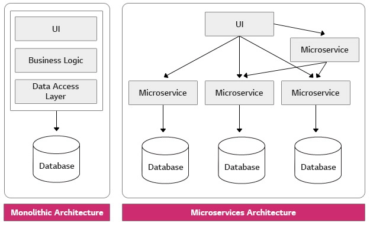
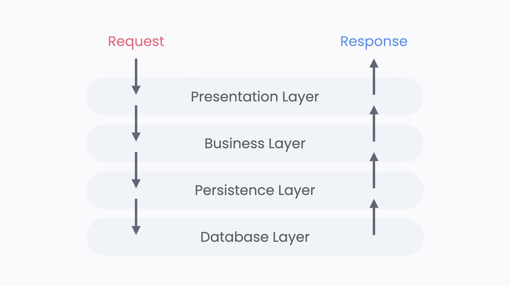

## 소프트웨어 아키텍처란?

**소프트웨어 구조** 또는 **소프트웨어 아키텍처**(software architecture)는 소프트웨어 시스템에 대해 추론하는 데 필요한 구조들의 집합이며, 그러한 구조와 시스템을 만드는 규율이다. 각 구조는 소프트웨어 요소, 요소 간의 관계, 그리고 요소와 관계 모두의 속성으로 구성된다. 

좋은 아키텍처는 변경 비용을 줄이고, 팀 간 협업을 원활하게 한다.

### Infra Level (인프라, 배포 단위)

1️⃣ **모놀리식 아키텍처**

- **하나의 통합된 코드 베이스로 여러 비즈니스 기능을 수행하는 전통적이 아키텍처 스타일**이다.
- 단일 애플리케이션 내에 서비스의 모든 로직이 들어가 있는 구조이다.
- 단일 코드 베이스를 가지고 있기 때문에 **변경 사항을 적용하고 유지 보수하는 것이 상대적으로 간단하다.**
- 단일 애플리케이션으로 모든 것을 처리하기 때문에 **인프라 구조의 복잡성이 낮아지고 운영 비용이 감소한다.**
- 하지만 **특정 기능만 확장해서 배포하는 데 어려움이 있고**, **작은 변경 사항도 전체 애플리케이션을 다시 배포해야하는 번거로움이 있다.**

**→ 프로젝트 규모가 작고, 빠른 MVP 모델이 필요하는 경우 적용되는 모델이다.**

**2️⃣ 마이크로 서비스 아키텍처(MSA)**

- **소프트웨어 애플리케이션을 여러 작고 독립적인 서비스로 나누는 아키텍처 스타일**이다.
- 애플리케이션을 작고 독립적인 서비스로 나누어 각 서비스가 특정 비즈니스 기능을 수행하도록 한다.
- MSA는 **다른 마이크로서비스를 배포하지 않고도 마이크로서비스를 변경, 배포, 출시할 수 있어야한다.**
- 마이크로 서비스는 DB를 공유하지 않으며, 다른 마이크로서비스의 데이터를 사용할 경우 API 등을 통해 접근한다.
- **테스트와 디버깅이 어렵고, 모놀리식 아키텍처에 비해 인프라 구조가 복잡해진다.**

**→ 프로젝트 규모가 크고 서비스를 만드는 독립적인 팀이 존재하는 경우, 유연한 확장이 요구될 경우에 적용되는 모델이다.**


### Project Level (프로젝트 단위)

**1️⃣ 단일 모듈**

- 하나의 프로젝트, 하나의 빌드 산출물을 가진다.
- 작은 팀이나 서비스, 빠른 MVP에 잘 맞는 설계이다.
    
    ```
    my-app/
    └── src/
        ├── user/
        ├── order/
        └── product/
    ```
    

**2️⃣ 멀티 모듈**

- 각 모듈은 독립 빌드 단위이며, 의존성을 선언해야한다.
- 각 모듈마다 책임 분리가 쉬워 여러 개발자가 협업하는 데에 유리하다.
- 특정 모듈만 배포해야 하는 상황이 생기면 멀티 모듈 구조를 고려한다.
    
    ```java
    my-app/                   
    ├── app-api/                 
    ├── app-core/  
    ├── app-scheduler/              
    └── common/                   
    ```
    

### Code Level (코드 단위)

**1️⃣ 도메인 기반 구조**

- 비즈니스 기능 기준으로 나누는 방식
    
    ```
    member/
      ├─ controller
      ├─ service
      ├─ repository
    order/
      ├─ controller
      ├─ service
      ├─ repository
    ```
    
- **도메인형 구조의 장점**
    - 도메인별 응집도가 높아진다. → 도메인의 흐름을 파악하기 쉽다.
    - 도메인과 관련된 기능이 변경되었을 때, 변경 범위가 작다.
    - 사용자 행위별로 세분화해서 표현이 가능하다.
- **도메인형 구조의 단점**
    - 애플리케이션의 전반적인 흐름을 한눈에 파악하기 어렵다.
    - 개발자의 관점에 따라 어느 도메인에 둘지 애매한 클래스들이 존재한다.

**2️⃣ 계층 기반 구조**

- 기술 역할 기준으로 나누는 방식
    
    ```
    controller/
    service/
    repository/
    domain/
    ```
    
- **계층형 구조의 장점**
    - 프로젝트의 전반적인 이해도가 낮아도, 패키지 구조만 보고 전체적인 구조를 파악할 수 있다.
        
        → 현재 로직이 어떤 흐름으로 흘러가는지 패키지만 보고 알 수 파악할 수 있다.
        
    - 계층 별 응집도가 높아진다.
        
        → 계층 별 수정이 일어날 때, 하나의 패키지만 보면 된다.
        
- **계층형 구조의 단점**
    - 도메인 별 응집도가 낮다.
        
        → 도메인 별 흐름을 파악하려면, 모든 패키지를 봐야 파악할 수 있다.
        
    - 도메인 관련된 기능이 변경되었을 때, 변경 범위가 크다.
        
        → 하나의 도메인을 수정하려면 여러 패키지에서 변경이 일어날 수 있다.
        
    - 하나의 패키지에 많은 클래스들이 모이게 된다.
    - 사용자의 행위 표현이 어렵다.
        
        → 하나의 기능을 구현하면, 모든 패키지에 흩어져 있게 된다.
        

**3️⃣ 하이브리드 구조**

- **도메인 기반 구조**와 **계층 기반 구조**가 혼합되어 쓰이는 방식
- 상위는 도메인으로 나누고, 내부는 계층으로 나누는 방식이 실무에서 가장 많이 쓰인다. → 이런 구조를 **도메인 기반 구조**라고 하기도 한다.
    
    ```
    member/
      ├─ controller
      ├─ service
      └─ repository
    ```
    

### 어떤 아키텍처를 사용해야할까?

**아키텍처 선택에는 정답이 없다**. 팀 규모, 서비스 복잡도, 배포 전략에 따라 적합한 구조가 달라지기 때문이다.

일반적으로 작은 팀이나 빠른 MVP 개발에는 단일 모듈 + 하이브리드 구조가 적합하다. 서비스가 커지면서 빌드 시간이 길어지거나 특정 모듈만 독립적으로 배포해야 하는 상황이 생기면 멀디 모듈 전환을 고려할 수 있다.

결국 좋은 아키텍처란 **현재 팀과 서비스 상황에서 변경 비용을 줄이고 협업을 원활하게 만드는 구조**이다.

# Swagger란?

<aside>

**Swagger**는 개발자가 개발한 REST API를 OpenAPI를 기반으로 자동으로 문서화 해주고, 접속해서 개발자 및 제 3자가 편리하게 테스트 할 수 있는 오픈소스 소프트웨어 프레임워크다.

</aside>

## Gradle 의존성 추가

```groovy
// Swagger
implementation 'org.springdoc:springdoc-openapi-starter-webmvc-ui:3.0.1'
implementation 'org.springdoc:springdoc-openapi-starter-webmvc-api:3.0.1'
```

- org.springdoc:springdoc-openapi-starter-webmvc-**ui → API 문서와 Swagger UI를 제공해준다.**
- org.springdoc:springdoc-openapi-starter-webmvc-**api → API 문서 데이터를 만들어준다.**

→ 위에 있는 ui 의존성 안에 api 의존성이 포함되어 있기 때문에 **ui 의존성만 추가해도 된다!**

- 또한, 위의 springdoc라이브러리의 Swagger는 꾸준히 업데이트가 되고 있다고 하지만, springfox는 2020년 이후 업데이트가 되지 않는다고 한다. 따라서 springdoc을 사용하도록 하자! (springfox도 업데이트를 하고 있다는 얘기도 있지만, 꾸준히 업데이트 되어왔던 springdoc을 사용하는 것이 낫다.)

## Swagger Config 작성

- Spring에서 OpenAPI(=swagger) 문서의 **메타정보 + 보안 설정**을 정의하는 설정 클래스
- OpenAPI 객체를 빈으로 등록하기 위한 목적으로 쓰인다.

```groovy
@Configuration
public class SwaggerConfig {

    @Bean
    public OpenAPI swagger() {
        Info info = new Info().title("UMC10th").description("10기 Swagger").version("0.0.1");

        // JWT 토큰 헤더 방식
        String securityScheme = "JWT TOKEN";
        SecurityRequirement securityRequirement = new SecurityRequirement().addList(securityScheme);

        Components components = new Components()
                .addSecuritySchemes(securityScheme, new SecurityScheme()
                        .name(securityScheme)
                        .type(SecurityScheme.Type.HTTP)
                        .scheme("Bearer")
                        .bearerFormat("JWT"));

        return new OpenAPI()
                .info(info)
                .addServersItem(new Server().url("/"))
                .addSecurityItem(securityRequirement)
                .components(components);
    }
}
```

→ 워크북에서 제공한 `SwaggerConfig` 클래스

### **1️⃣ API 기본 정보 설정**

```groovy
Info info = new Info()
		.title("UMC10th")
		.description("10기 Swagger")
		.version("0.0.1");
```

- API 문서 기본 정보 설정 (Swagger 페이지에 들어가면 상단에 뜨는 정보)

### **2️⃣ 보안 설정 (JWT)**

```java
String securityScheme = "JWT TOKEN";
SecurityRequirement securityRequirement = new SecurityRequirement().addList(securityScheme);
```

- 모든 엔드포인트에 JWT TOKEN 적용

```java
Components components = new Components()
	      .addSecuritySchemes(securityScheme, new SecurityScheme()
	              .name(securityScheme)
	              .type(SecurityScheme.Type.HTTP)
	              .scheme("Bearer")
	              .bearerFormat("JWT"));
```

- Components는 OpenAPI 명세에서 재사용 가능한 요소들을 모아두는 저장소이다.
- securityScheme를 등록해두면 이름으로 참조할 수 있다.

### **3️⃣ OpenAPI 객체 생성**

```java
return new OpenAPI()
        .info(info)
        .addServersItem(new Server().url("/"))
        .addSecurityItem(securityRequirement)
        .components(components);
```

- `addServersItem(new Server().url("/"))` 는 Swagger UI에서 API 호출 시 기준이되는 서버 URL이다.

## 🥊 Swagger vs OpenAPI

### OpenAPI란?

OpenAPI는 RESTful API를 설명하기 위한 오픈 표준 역할을 하며, 개발자에게 API의 구조와 동작을 정의하는 구조화된 접근 방식을 제공한다.

개발자는 OpenAPI 사양을 준수함으로써 API가 잘 문서화되고 다른 사람이 쉽게 사용할 수 있다는 것을 보장할 수 있다.

→ 즉, OpenAPI는 RESTful API를 설명하기 위한 사양이며, Swagger는 OpenAPI 사양을 구현하는 오픈 소스 소프트웨어 프레임워크이다.

## 도메인형 아키텍처

```
📁 domain
 ├── 📁 member
 │    ├── controller
 │    ├── service
 │    ├── entity
 │    ├── dto
 │    └── ...
 │
 ├── 📁 store
 │    ├── controller
 │    ├── service
 │    ├── entity
 │    ├── dto
 │    └── ...
 │
 ├── 📁 mission
 │    ├── controller
 │    ├── service
 │    ├── entity
 │    ├── dto
 │    └── ...
 │
 └── 📁 global
      ├── config
      ├── exception
      ├── common
      └── ...
```

- **도메인을 기준으로 패키지를 나눈 방식**
- 도메인이란?
    
    → 소프트웨어 시스템이 해결하고자 하는 특정 문제 영역 도는 비즈니스 활동 범위
    
- 프로젝트 전반적으로 사용되는 클래스들(auth, config, BaseEntity 등)은 domain과 같은 레벨에서 global 패키지 안에 구성한다.
- **도메인형 구조의 장점**
    - 도메인별 응집도가 높아진다. → 도메인의 흐름을 파악하기 쉽다.
    - 도메인과 관련된 기능이 변경되었을 때, 변경 범위가 작다.
    - 사용자 행위별로 세분화해서 표현이 가능하다.
- **도메인형 구조의 단점**
    - 애플리케이션의 전반적인 흐름을 한눈에 파악하기 어렵다.
    - 개발자의 관점에 따라 어느 도메인에 둘지 애매한 클래스들이 존재한다.

## 계층형 구조 VS 도메인형 구조

- **계층형 구조**는
    - 규모가 작고 도메인이 적은 경우에 많이 사용한다.
    - 도메인이 적으면 하나의 패키지안에 클래스들이 많아질 가능성이 적다.
    - 도메인의 변경이 일어나도, 규모가 작은 만큼 변경 범위가 그렇게 크지 않을 수 있다.
- **도메인형 구조**는
    - 규모가 크고 도메인이 많은 경우에 많이 사용한다.
    - 도메인이 많을 수록 도메인의 응집도가 높은 것이 좋다.
    - 규모가 큰 만큼 사용자 행위 별로 클래스를 분리하는 경우가 많을 수 있다.

**→ 프로젝트 규모와 팀 상황에 맞게 선택하는 것이 중요하다!**


## 먼저, 계층형 아키텍처란?

**소스 코드의 역할과 관심사에 따라 이를 계층으로 분리한 아키텍처**이다.

각 계층은 어플리케이션 내에서의 특정 역할과 관심사(화면 표시, 비즈니스 로직 수행 및 DB 작업 등) 별로 구분되며, 특정 역할을 수행하고 하위에 위치한 계층에만 의존하는 특징을 갖는다.


1. **Presentation Layer (표현 또는 UI)**
    - 사용자와의 상호 작용을 담당하며, 사용자의 요청 처리를 응용 계층에 위임한다.
    - MVC 패턴에서의 컨트롤러와 뷰가 표현 계층에 속한다.
2. **Business Layer (응용)**
    - 모델이나 인프라 계층을 사용해서 필요한 기능을 구현하고 결과를 표현 계층에 리턴한다.
    - 서비스 기능이 응용 계층에 속한다.
3. **Presistence Layer (도메인 또는 모델)**
    - 도메인 로직을 구현한다.
    - 예를 들어, 주문 모델의 최소 제약 조건과 상태 변경과 같은 로직이 이 계층에 속한다.
4. **Database Layer (인프라 또는 영속)**
    - DB 연동이나 문자 발송과 같은 구현 기술을 지원한다.
    - DB 연동을 처리하는 DAO가 인프라 계층에 속하는 전형적인 구성 요소다.

보통 웹 애플리케이션을 계층형 아키텍처로 구현할 때는 일반적으로 위와 같이 4개의 계층을 구성한다. 

**구조가 단순하고 규칙이 명확하기 때문에 코드 실행 흐름을 추적하기 쉽다는 장점**이 있다.

도메인 계층 (Presistence Layer) 구현에 미숙한 개발자가 많고, 도메인 계층 없이 응용 계층과 인프라 계층만으로 구현하는 경우가 많다. 이러한 경우에는 **도메인 로직이 인프라와 응용 계층으로 분산되는 경향이 있어 코드 유지보수를 어렵게 만들기도 한다.**

```sql
update member set status = 20 where member_id = ? and status = 10
```

→ 쿼리에 도메인 로직이 스며들어간 상황

```java
int cnt = mdao.updateMemberStatus(id);
if (cnt == 0) {
		// 변경 건이 없으므로 변경 실패 처리
}
```

→ 분리된 도메인 로직

<aside>

‼ 이와 같이 도메인 로직을 한 곳에 모으는 방법 중 하나가 **DDD** 이다!

</aside>

## DDD (Domain-Driven Design, 도메인 주도 설계)

<aside>

도메인 모델을 기반으로 복잡한 소프트웨어 시스템을 설계하고 개발하는 방법론이다.

</aside>

- 비즈니스 Domain 별로 나누어 설계하는 방식

### DDD에서 도메인 모델의 구성 요소

**1️⃣ 엔티티 (Entity)**

- 각 엔티티 객체는 고유의 식별자를 가지며, 각 엔티티는 식별자로 구분된다.
- 내부 상태가 바뀌어도 식별자는 바뀌지 않는다.
- ex) 각 주문 엔티티는 서로 다른 주문번호를 식별자로 갖는다.

**2️⃣ 벨류 (Value)**

- 고유의 식별자를 갖지 않으며 개념적인 값을 표현한다.
- 값을 불변으로 구현하는 것을 권장한다.
- ex) 금액, 배송 주소 같은 값이 될 수 있다.

**3️⃣ 애그리거트 (Aggregate)**

- 애그리거트는 관련된 객체를 묶어 하나의 개념적인 단위를 표현한다.
- 모델의 일관성을 관리하는 단위가 된다.
- ex) 주문 애그리거트는 Order 엔티티, OrderLine 밸류 집합, ShippingAddress 밸류로 구성될 수 있다.

**4️⃣ 리포지토리 (Repository)**

- 도메인 객체를 물리적인 저장소와 연결할 때 사용되는 모델이다.
- 도메인 객체를 저장하고 조회할 때 사용되는 인터페이스를 제공한다.
- 리포지토리는 애그리거트 단위로 존재한다.

**5️⃣ 도메인 서비스 (Domain Service)**

- 특정한 애그리거트에 속하지 않은 로직을 구현한다.
- 외부 연동이 필요한 도메인 로직도 도메인 서비스를 사용해서 표현한다.

**6️⃣ 도메인 이벤트 (Domain Event)**

- 도메인 내에서 발생한 이벤트를 표현한다.
- 도메인의 상태가 변경될 때 도메인 이벤트가 발생한다.
- 도메인 이벤트는 주로 다른 부분에 변화를 알리기 위해 사용된다.

## 도메인형 아키텍처

위에 설명한 DDD를 적용하기 위한 패키지 구조로는 도메인형 아키텍처가 계층형 아키텍처보다 적합하다.

```
도메인형 아키텍처 패키지구조 예시
📁 domain
 ├── 📁 member
 │    ├── controller
 │    ├── service
 │    ├── entity
 │    ├── dto
 │    └── ...
 │
 ├── 📁 store
 │    ├── controller
 │    ├── service
 │    ├── entity
 │    ├── dto
 │    └── ...
 │
 ├── 📁 mission
 │    ├── controller
 │    ├── service
 │    ├── entity
 │    ├── dto
 │    └── ...
 │
 └── 📁 global
      ├── config
      ├── exception
      ├── common
      └── ...
```

특정 도메인에 관련된 코드가 하나의 경로에 묶여있기 때문에 **사고방식과 코드 구조가 일치**하다.

## DTO (Data Transfer Object, 데이터 전송 객체)

**애플리케이션의 서로 다른 프로세스 간에 데이터를 이동시킨는 데 사용되는 객체**이다.

DTO는 애플리케이션의 다른 부분들을 서로 분리하는 데 도움을 주어, 코드가 더 체계적이고 유지 보수하기 쉬워진다. 일반적으로 DTO에는 비즈니스 로직이 존재하지 않고 오로지 데이터를 담는 역할만 한다.

### DTO 구현 방식

DTO는 보통 일반적인 클래스로 구현된다.

- 데이터를 담는 private 필드
- 데이터에 접근하는 접근자
- 객체를 생성하는 생성자
- 객체를 비교하거나 출력할 때 유용한 toString(), hashCode(), equals() 메서드의 재정의

→ 보통 위의 4가지 요소가 DTO에 포함된다.

```java
public class MatchingRes {

    private Long id;
    private Long requestUserId;
    private Long targetUserId;

    public MatchingRes(Long id, Long requestUserId, Long targetUserId) {
        this.id = id;
        this.requestUserId = requestUserId;
        this.targetUserId = targetUserId;
    }

    public Long getId() {
        return id;
    }

    public Long getRequestUserId() {
        return requestUserId;
    }

    public Long getTargetUserId() {
        return targetUserId;
    }

    @Override
    public String toString() {
        return "MatchingRes{" +
                "id=" + id +
                ", requestUserId=" + requestUserId +
                ", targetUserId=" + targetUserId +
                '}';
    }

    @Override
    public boolean equals(Object o) {
        if (this == o) return true;
        if (!(o instanceof MatchingRes that)) return false;
        return java.util.Objects.equals(id, that.id)
                && java.util.Objects.equals(requestUserId, that.requestUserId)
                && java.util.Objects.equals(targetUserId, that.targetUserId);
    }

    @Override
    public int hashCode() {
        return java.util.Objects.hash(id, requestUserId, targetUserId);
    }
}
```

→ 극단적인 예시

```java
// Lombok 사용 버전
@Getter
@Builder
@AllArgsConstructor
@EqualsAndHashCode
@ToString
public class MatchingRes {
    private Long id;
    private Long requestUserId;
    private Long targetUserId;
}
```

### DTO를 꼭 써야할까?

**1️⃣ 계층 분리**

- 만약 Entity를 그대로 클라이언트에게 전달한다면, DB에 저장되어 있는 구조가 외부에 노출된다.
- DB의 구조가 변경된다면 API 명세가 이전과 같지 않아질 수 있기 때문에 Entity와 API 스펙을 분리하기 위해서 DTO가 사용된다.

**2️⃣ 필요한 데이터 분류**

- 클라이언트는 DB에 저장된 데이터의 가공된 버전을 필요로 하는 경우가 많다.
- 따라서 클라이언트에게 전달하는 과정에서 데이터를 가공하거나 필요한 데이터만 전달하기 위해 DTO가 사용된다.

**3️⃣ API 명세**

- DTO는 API 스펙 역할도 하기 때문에, 클라이언트와 약속하는 과정에서 필요할 수 있다.

## Record 란?

Java 16 에서 정식으로 출시된 특별한 유형의 클래스로, **불변** 데이터를 간결하고 읽기 쉽게 전달하는 데 초점을 두고 있으며 DTO를 기존 클래스로 구현했을 때 필요했던 반복적인 코드를 많이 줄여준다.

- 불변성: record 객체가 한 번 생성되면, 내부 데이터를 변경할 수 없다.
- 간결한 문법: 필드만 선언하면 Java가 자동으로 **생성자, Getter, equals(), hashCode(), toString()** 메서드를 생성한다. 따라서 코드가 간결해지고 가독성이 좋아진다.
- Setter 없음: Record는 불변 객체이기 때문에 Setter를 사용할 수 없다.

```java
@Builder
public record MatchingRes(
        Long id,
        Long requestUserId,
        Long targetUserId
) {}
```

→ 빌더패턴은 자동으로 제공하지 않기 때문에 보통 같이 붙여 사용한다.

### DTO(class) vs Record

보통 DTO는 데이터를 담고, 옮기는 역할로 사용된다. 수정자가 필요한 경우는 거의 없다. 또한 데이터베이스에 저장되지 않고 일회성으로 사용되기 때문에 중간에 값이 변경되는 경우도 드물다.

이러한 이유로 개인적으로 자바의 record를 최대한 활용해 DTO 클래스를 정의할 때 생기는 보일러 플레이트 코드를 최대한 줄이는 방식으로 구현하는 방식을 선호한다.

## Converter(컨버터)란?

Converter는 변환기라는 뜻으로, **개발자의 의도대로 자료형을 변경하거나, 객체를 변경하는 등 데이터의 형태를 변경하는 역할을 한다.**

보통 서버에서는 엔티티에 저장된 데이터를 응답 DTO에 옮겨서 전달하는 과정에서 많이 쓰인다. 

또한 여러 데이터를 모아 엔티티 객체를 생성하는 경우에서도 Converter가 사용된다.

### Converter 사용 예시

```java
// 응답 DTO 예시
public class MatchingResDto {

    @Builder
    public record MatchingRes(
            Long id,
            Long requestUserId,
            Long targetUserId,
            Long projectId,
            RoleField field,
            String customField,
            MatchingStatus matchingStatus,
            MatchingRequestType requestType,
            LocalDateTime expiresAt
    ){}
    
    ...
}
```

```java
// Matching 엔티티를 응답 DTO로 변환하는 함수
public class MatchingConverter {

    public static MatchingResDto.MatchingRes toMatchingResDto(Matching matching) {
        return MatchingResDto.MatchingRes.builder()
                .id(matching.getId())
                .requestUserId(matching.getRequestUser().getUserId())
                .targetUserId(matching.getTargetUser().getUserId())
                .projectId(matching.getProject().getId())
                .field(matching.getField())
                .customField(matching.getCustomField())
                .matchingStatus(matching.getMatchingStatus())
                .requestType(matching.getRequestType())
                .expiresAt(matching.getExpiresAt())
                .build();
    }
    
    ...
}
```

### Converter를 왜 사용해야할까?

보통 서버에서는 엔티티에 담긴 데이터를 그대로 클라이언트에게 전달하지 않고 API 명세에 따라 데이터를 가공하여 전달한다.

만약 데이터를 가공하는 로직이 서비스 코드에 모두 포함된다면, 서비스 코드는 응용 계층의 흐름 로직과 데이터 변환 로직이 뒤섞이게 된다.

이는 서비스 코드가 담당해야 하는 “어떤 순서로 무엇을 처리할까” 라는 관심사에서 벗어나, “데이터를 어떻게 표현할 것인가” 라는 표현 계층의 관심사까지 떠안게 되는 문제를 낳는다.

또한 같은 엔티티를 여러 서비스나 여러 API에서 변환해야 할 때, Converter에 정의된 함수를 호출해 재사용할 수 있다.

<aside>

따라서 Converter를 별도로 분리하면 **각 계층이 자신의 책임에만 집중**할 수 있고, 변환 로직의 변경에 서비스 로직에 영향을 주지 않아 **유지보수성도 높아지며,** 보일러 플레이트 코드를 줄여 **재사용성을 높인다.**

</aside>