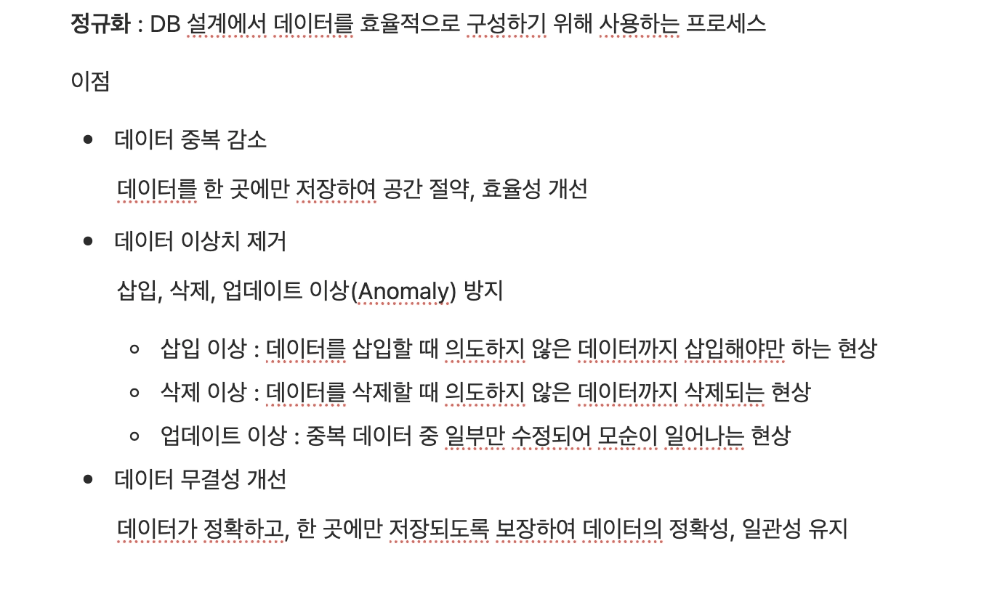
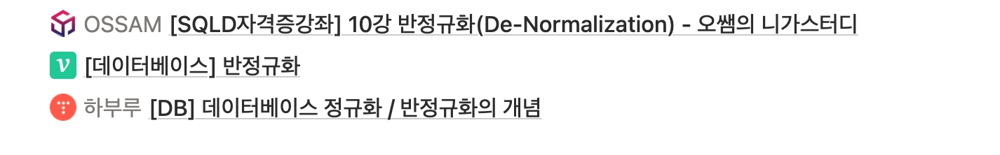
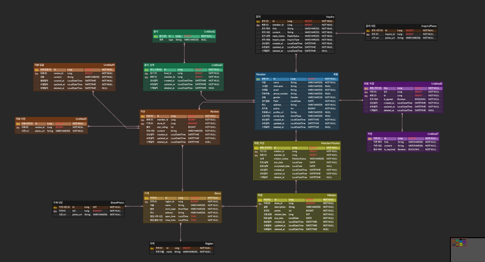

## 윤샘의 워크북 리뷰

- 정규화 키워드를 정리할 때 이상치에 대한 상세한 내용까지 알아볼 생각을 하지 못했는데, 윤샘이 이렇게 이상 현상을 정리해 줘서 정규화를 해야하는 이유에 대해 더 깊이 이해할 수 있었습니다! 또, 참고한 자료까지 링크를 걸어주셔서 추가적인 내용까지 볼 수 있었습니다! 😊

## 미션 기록

- 대부분의 테이블에 생성일자 / 수정일자 / 삭제일자를 넣어 정렬을 가능하게 했고, 삭제 일자를 넣음으로써 soft delete가 가능하도록 했습니다.
- 대부분의 사진은 여러 장 등록이 가능하기 때문에 사진을 저장하는 엔티티를 따로 두어 정규화 했습니다.
- 필요한 경우 ENUM을 활용해 데이터 타입을 분류했습니다.
    - Member의 SocialType → GOOGLE / NAVER / KAKAO / APPLE
    - Inquiry의 ReplyStatus → PENDING / COMPLETED
    - MemberMission의 MissionStatus → PENDING / COMPLETED / CANCELED /  EXPIRED
    - Store의 StoreType → KOREAN / JAPANESE / CHINESE / WESTERN / CAFE
    