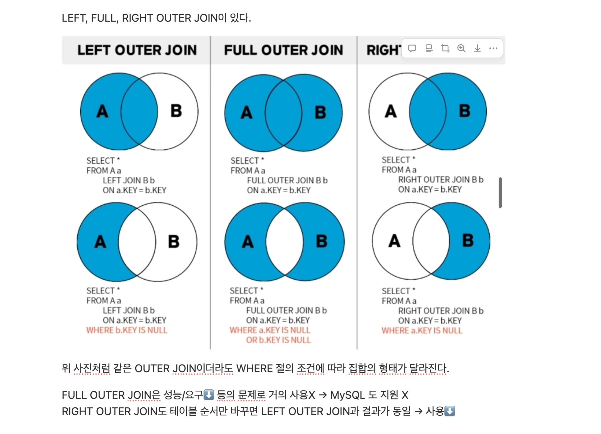

## 윤샘의 워크북 리뷰

- 이 사진 자료 덕분에 outer join에 대해 이해가 명확히 됐습니다! key값이 null인 경우를 이용해서 범위를 다르게 설정할 수 있다는 걸 생각 못했네요!

## 미션기록

### 리뷰 작성하는 쿼리(사진의 경우는 일단 배제)

```sql
insert into Review(member_id, store_id, star_rating, content)
values (1, 1, 5, "음 너무 맛있어요 포인트도 얻고 ...");

insert into ReviewPhoto(review_id, photo_url)
values (1, "url1"), (1, "url2");
```


### 내가 진행중, 진행 완료한 미션 모아서 보는 쿼리(페이징 포함)

```sql
select S.id, S.name, MM.id, MM.description, MM.mission_status, M.id, M.points
from Mission M join MemberMission MM on M.id = MM.mission_id
		join Store S on S.id = M.store_id
where MM.mission_status in ('PENDING', 'COMPLETED') 
		and MM.member_id = :member_id
		and (
					MM.due_date > :cursor_due_date
					or (MM.due_date = :cursor_due_date and MM.id > :cursor_id)
				)
order by MM.due_date asc, MM.id asc
limit :page_size;
```


### 마이 페이지 화면 쿼리

```sql
select id, profile_url, nickname, email, phone_number, points
from member
where id = :member_id
```


### 홈 화면 쿼리 (현재 선택 된 지역에서 도전이 가능한 미션 목록, 페이징 포함)

```sql
-- 선택한 지역에서 달성한 미션 개수
select count(*)
from Region R join Store S on R.id = S.region_id
		join Mission M on M.store_id = S.id
		join MemberMission MM on MM.mission_id = M.id
where R.name = :region_name 
		and MM.mission_status = 'COMPLETED' 
		and MM.member_id = :member_id

-- 선택한 지역에서 도전 가능한 미션 목록
select M.id, 
		M.description, 
		M.points, 
		S.id, 
		S.name, 
		S.store_type,
		datediff(M.due_date, now()) as d_day
from Region R join Store S on R.id = S.region_id
		join Mission M on M.store_id = S.id
where R.name = :region_name
		and M.due_date >= now()
		and not exists (
			 select 1
			 from MemberMission MM
			 where M.id = MM.mission_id 
					 and MM.member_id = :member_id
		)
		and (
				M.due_date > :cursor_d_day
				or (M.due_date = :cursor_due_date and M.id > :cursor_id)
		)
order by M.due_date asc, M.id asc
limit :page_size
```