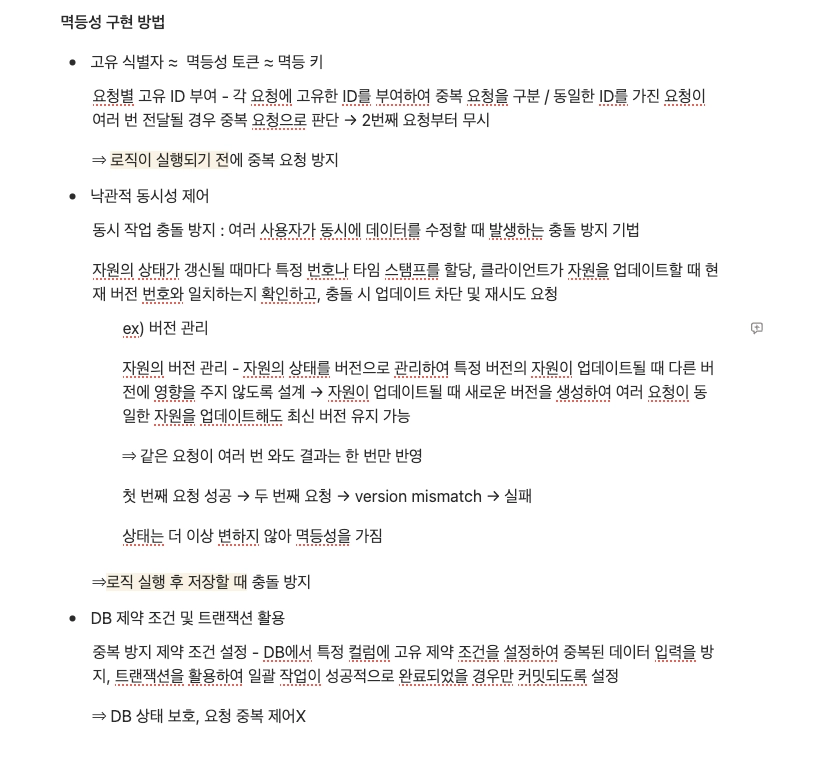

# 피어 리뷰

- 멱등성 구현 방법 중 멱등 키 사용 방법 이외의 방법이 있는 줄 몰랐어요! 멱등 키를 사용하면 클라이언트에게 의존해야하는데 낙관적 동시성 제어와 DB제약 조건을 활용하면 클라이언트 의존없이 서버자체만으로 멱등성을 구현할 수 있겠네요!


# 미션 기록
## 회원 가입
- `POST /members`
### Path Variable

❌

### Query Param

❌

### Request Header

- `Content-Type: application/json`

### Request Body

```json
{
		"name" : "윤서연",
		"gender" : "FEMALE",
		"birth" : "2004-01-03",
		"address" : "인천광역시 연수구 청능대로 124"
}
```

### Response Body

```json
{
		"status" : {
				"statusCode" : "M201",
				"message" : "success",
				"description" : "회원가입이 완료되었습니다."
		},
		"body" : {
				"memberId" : 1,
				"name" : "윤서연",
				"birth" : "2004-01-03",
				"address" : "인천광역시 연수구 청능대로 124"
		}
}
```
## 홈 화면 조회
- `GET /members/{memberId}`
### Path Variable

- `memberId`

### Query Param

- `regionName="안암동"`

### Request Header

- `Authorization: Bearer access_token`

### Request Body

```java
❌
```

### Response Body

```json
{
		"status" : {
				"statusCode" : "H200",
				"message" : "success",
				"description" : "홈 화면 조회가 완료되었습니다."
		},
		"body" : {
				"totalInformation" : {
						"memberId" : 1,
						"regionId" : 1,
						"regionName" : "안암동",
						"missionCount" : 7,
						"missionGoalCount" : 10
				},
				"missionList" : {
						{
								"missionId" : 1,
								"missionDescription" : "10,000 이상의 식사시",
								"missionPoints" :	500,
								"d_day" : 7,
								"storeId" : 1,
								"storeName" : "반이학생마라탕",
								"storeType" : "중식당"
						},
						{
								"missionId" : 2,
								"missionDescription" : "10,000 이상의 식사시",
								"missionPoints" :	500,
								"d_day" : 7,
								"storeId" : 2,
								"storeName" : "반이학생마라탕",
								"storeType" : "중식당"
						}
				}
		}
}
```

## 마이페이지 리뷰 작성하기
- `POST /missions/{memberMissionId}/reviews`
### Path Variable

- `memberMissionId`

### Query Param

❌

### Request Header

- `Content-Type: multipart/form-data`
- `Authorization: Bearer access_token`

### Request Body

| key | type | value |
| --- | --- | --- |
| review_content | text | “음 너무 맛있었어요~…” |
| star_rating | text | 5 |
| images | file | img1.png |

### Response Body

```json
{
		"status" : {
				"statusCode" : "R201",
				"message" : "success",
				"description" : "리뷰 작성이 완료되었습니다."
		},
		"body" : {
				"reviewId" : 1,
				"review_content" : "음 너무 맛있었어요~...",
				"star_rating" : 5,
				"images" : {
						"img1" : "iamgeurl",
						"img2" : "imageurl"
		}
}
```

## 미션 목록 조회(진행 중, 진행 완료)
- `GET /missions`
### Path Variable

❌

### Query Param

- `missionStatus=”PENDING”&missionStatus=”COMPLETED”`

### Request Header

- `Authorization: Bearer access_token`

### Request Body

```java
❌
```

### Response Body

```json
{
		"status" : {
				"statusCode" : "M200",
				"message" : "success",
				"description" : "나의 미션 목록이 조회되었습니다."
		},
		"body" : {
				"missionList" : {
						{
								"missionId" : 1,
								"missionDescription" : "10,000 이상의 식사시",
								"missionPoints" :	500,
								"missionStatus" : "COMPLETED"
								"storeId" : 1,
								"storeName" : "반이학생마라탕",
						},
						{
								"missionId" : 2,
								"missionDescription" : "10,000 이상의 식사시",
								"missionPoints" :	500,
								"missionStatus" : "PENDING",
								"storeId" : 2,
								"storeName" : "반이학생마라탕",
						}
				}
		}
}
```
## 미션 성공 누르기
- `PATCH /missions/{memberMissionId}/success`
### Path Variable

- `memberMissionId`

### Query Param

❌

### Request Header

- `Content-Type: application/json`
- `Authorization: Bearer access_token`

### Request Body

```json
{
		"missionStatus" : "COMPLETED"
}
```

### Response Body

```json
{
		"status" : {
				"statusCode" : "M200",
				"message" : "success",
				"description" : "미션 성공 요청을 보냈습니다."
		},
		"body" : {
				"memberMissionId" : 1,
				"missionDescription" : "12,000 이상의 식사를 하세요!",
				"missionStatus" : "COMPLETED"
		}
}
```