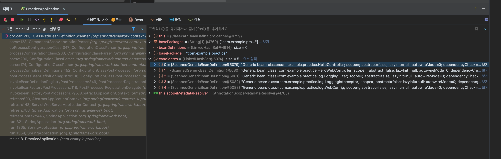
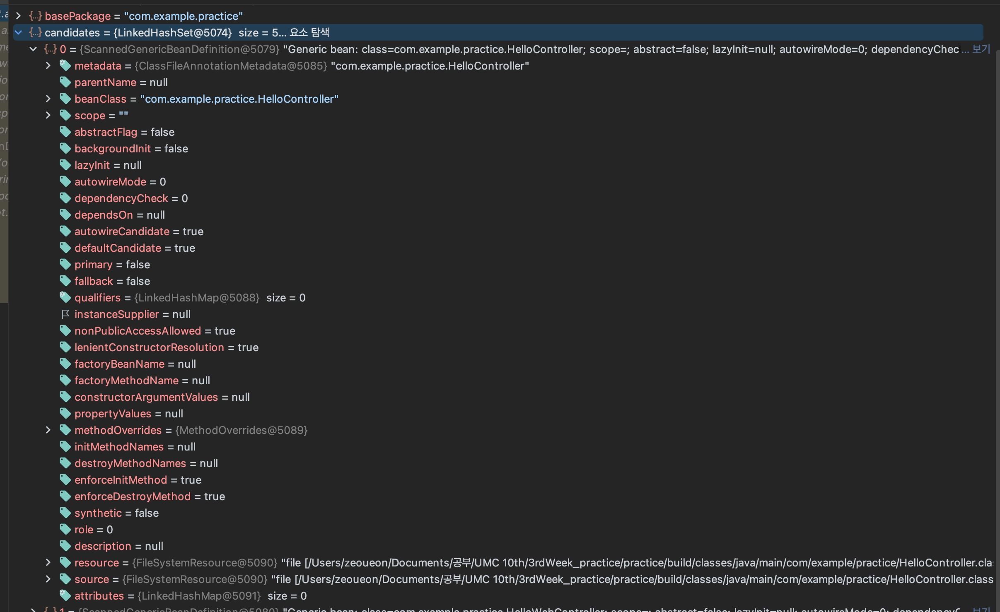
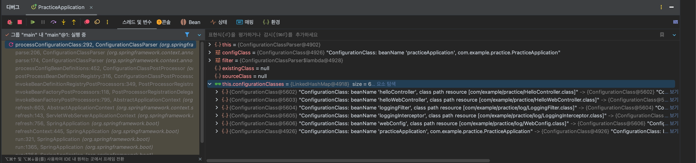
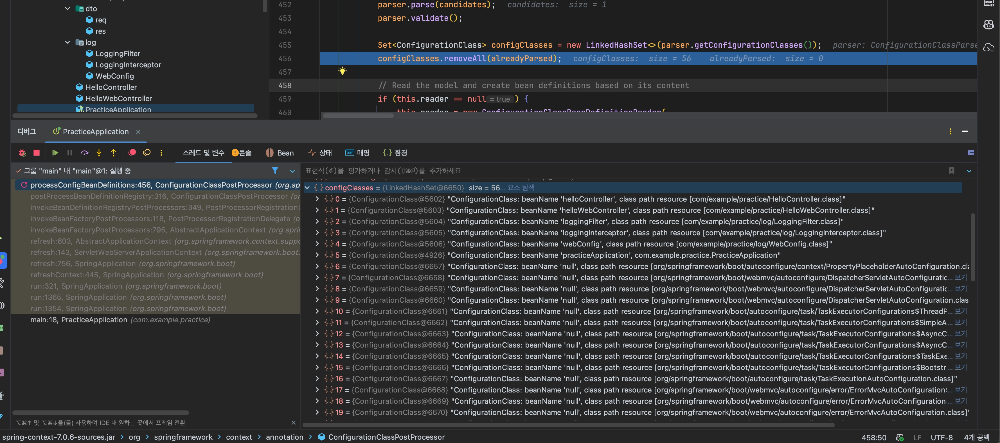
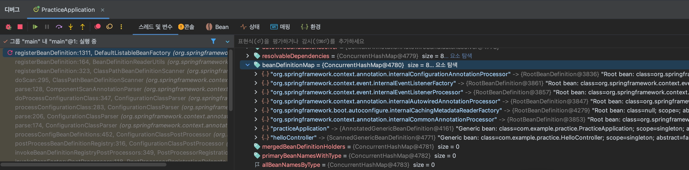
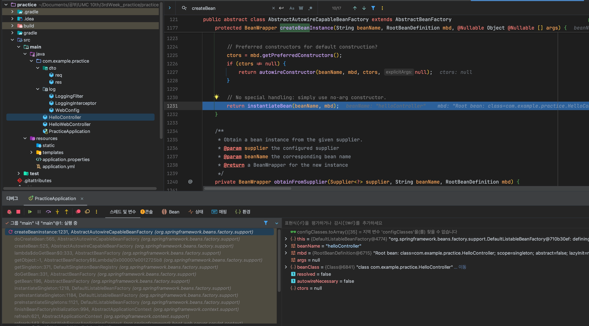
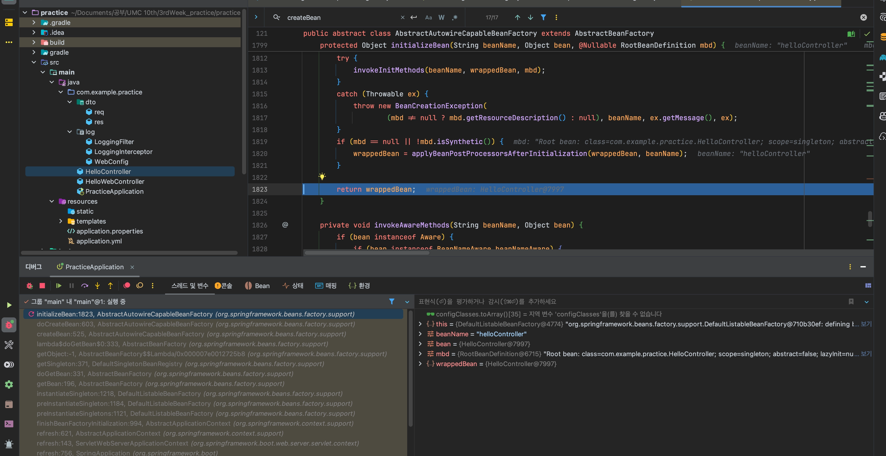
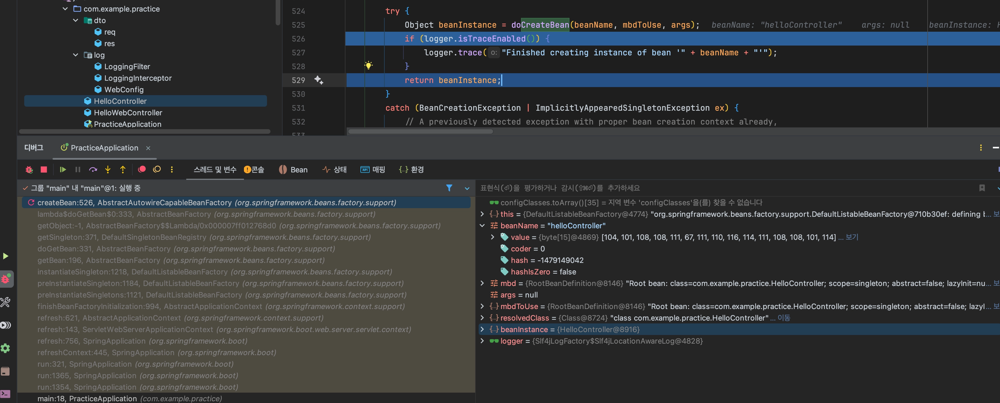

## 1️⃣ Bean 생성 전 Definition 등록

→ `ClassPathBeanDefinitionScanner` doScan함수의 빈 등록 후보들을 확인할 수 있다.

→ 아직 Bean으로 등록되기 전 빈에 대한 메타데이터들을 담고있다.

→ `ConfigurationClassPostProcessor`의 `processConfigBeanDefinitions`: 찾아둔 Configuration Class들 (아직 빈 등록 전)

→ `DefaultListableBeanFactory`의 `registerBeanDefinition`에서 `beanDefinitionMap`에 HelloController의 BeanDefinition을 등록하고 있다.

## 2️⃣ Bean 주입 및 생성

→ HelloController는 생성자 주입이 필요없음을 나타낸다.

→ `populateBean()`이 호출되지만, HelloController에는 주입할 값이 없어 실질적인 작업은 일어나지 않는다.

→ HelloController 초기화 완료

→ `AbstractAutowireCapableBeanFactory`의 `createBean`에서 HelloController 빈을 생성한 것을 확인할 수 있다.

### ‼️ Bean 생성 및 의존성 주입 흐름 정리

1. 어노테이션 기반으로 클래스들을 스캔한 뒤, 등록할 빈 후보들의 메타데이터들을 저장한다. **(Bean Difinition)**
2. `createBean()`이 호출되고 단순 메모리에 Bean Definition을 기반으로 빈 후보의 객체들을 생성한다. (여기서, 객체를 단순히 메모리에 생성하는 것고, 스프링 컨텍스트에 빈을 등록하는 것은 엄연히 다른 개념임!!) 이 과정에서 생성자 주입이 필요한 경우 생성자 선택과 의존성 주입이 함께 이루어진다.
3. `populateBean()`에서 필드/세터 주입이 필요한 객체들의 의존성 주입이 일어난다. 
4. `initializeBean()`에서 초기화가 일어난다.
5. 완성된 객체는 싱글톤으로 관리되며, 스프링 컨텍스트에 의해 관리되는 Bean으로 등록된다!