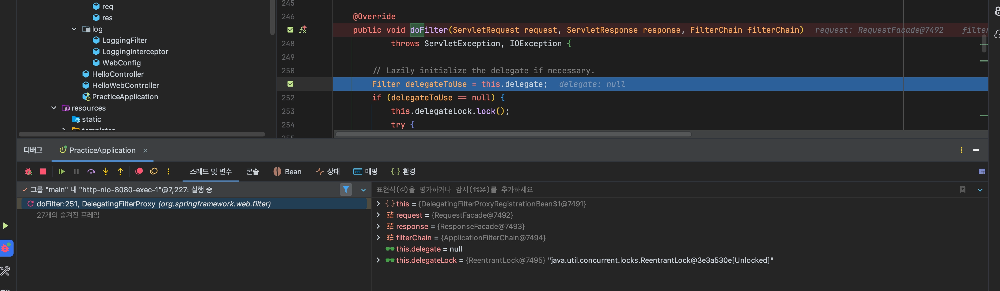
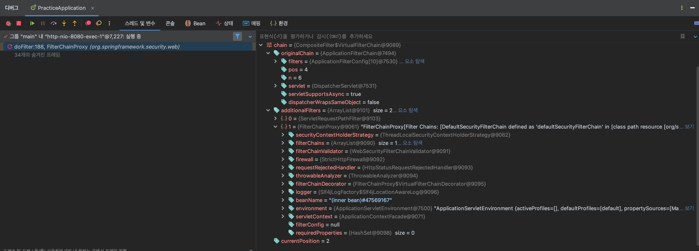
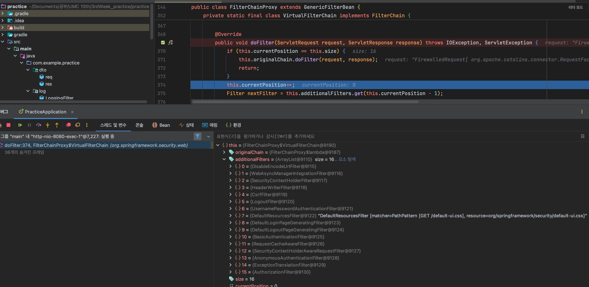

## 먼저, Spring Security는

- Spring Context를 이용해야하기 때문에, `DelegatingFilterProxy`를 통해 Spring Context로 필터 실행을 위임하고 `FilterChainProxy` → `VirtualFilterChain`을 사용해 `SecurityFilterChain`의 필터들을 순차적으로 실행한다.

### 1️⃣ DelegatingFilterProxy의 doFilter()

→ **서블릿 컨테이너**의 **FilterChain**에 들어와있는 것을 확인할 수 있음.

### 2️⃣ FilterChainProxy의 doFilter()


→ 일반 웹 필터들과 Spring Security Filter들이 함께 존재한다.

### 3️⃣ VirtualFilterChain의 doFilter()

→실제 보안 필터를 실행하는 객체는 `VirtualFilterChain`이라는 것을 확인할 수 있다.

- Spring Security Filter 종류 (총 16개)

### DelegatingFilterProxy

서블릿 컨테이너가 관리하는 필터 체인에 스프링 컨텍스트에 등록된 빈을 사용하는 필터를 이어주는 다리역할이라고 할 수 있다.

하지만, SpringBoot가 등장하고 내장 톰캣이 띄워지고, 애플리케이션 시작할 때 스프링 빈 정보를 기반으로 서블릿 컨테이너에 Filter를 자동 등록해주기 때문에

```java
@Component
public class MyFilter implements Filter {
    ...
}
```

이와 같이 `DelegatingFilterProxy`객체를 사용하지 않고 직접 구현한 스프링 빈 필터도 필터 체인에 넣을 수 있게 되었다.

이와 별개로 Spring Security 관련 필터는 단일 필터가 아니라 내부에 많은 보안 필터들이 존재하기 때문에 이 보안 필터들을 관리하는 FilterChainProxy(springSecurityFilterChain)이라는 빈이 존재하며 여전히 `DelegatingFilterProxy`를 통해 해당 필터 체인으로 진입하는 구조를 사용한다.