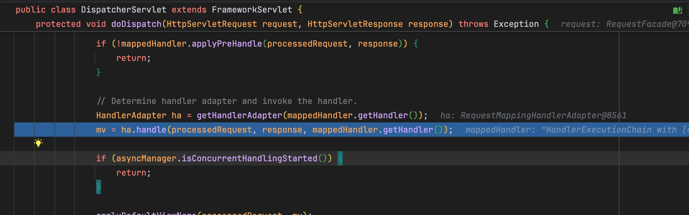
→ Json을 반환하는 컨트롤러와 마찬가지로 RequestMappingHandlerAdapter가 선택된다.
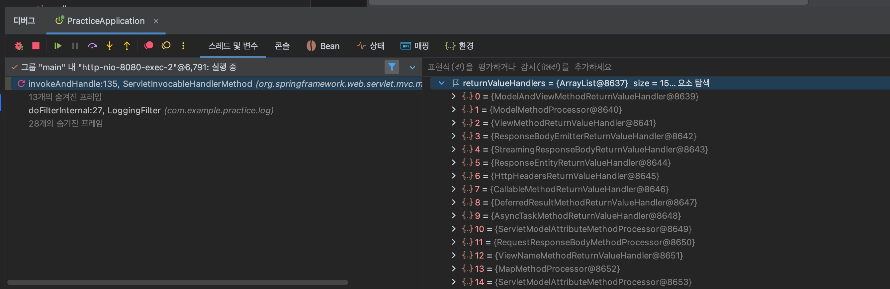
→ 마찬가지로 returnValueHandlers의 종류들을 볼 수 있다.
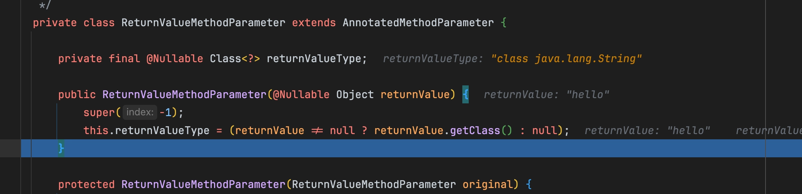
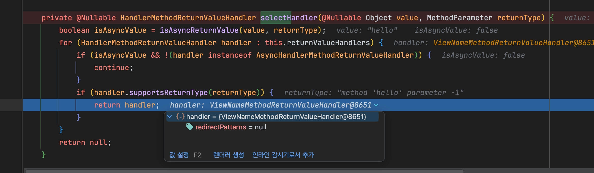
→ `ViewNameMethodReturnValueHandler`가 선택되었다.
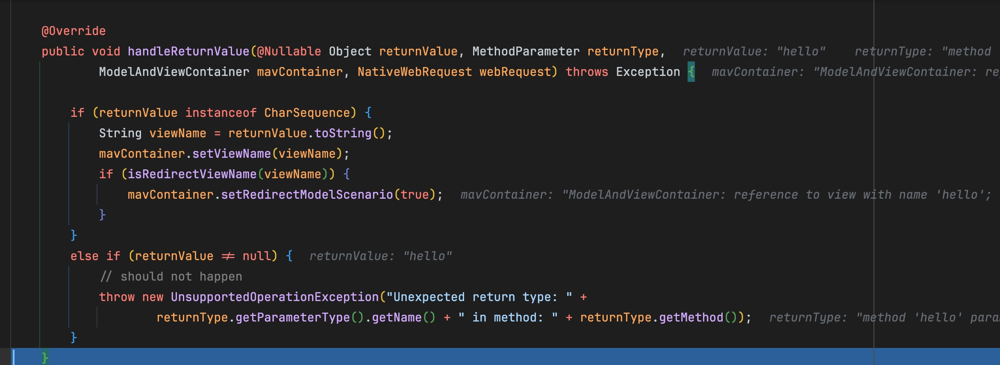
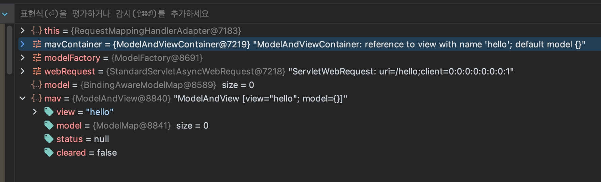
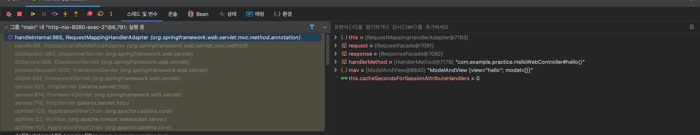
→ ModelAndView 생성
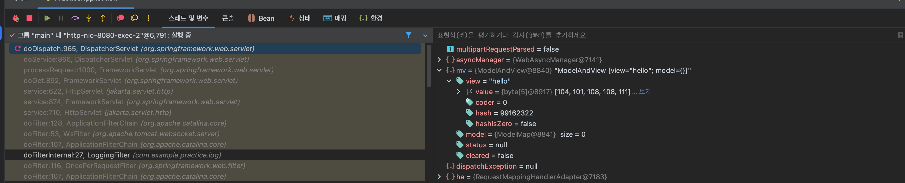
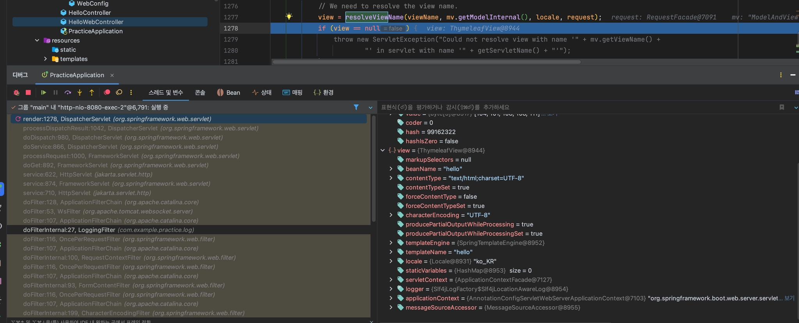
→ resolveViewName을 통해 ThymleafView객체 만들어진다.
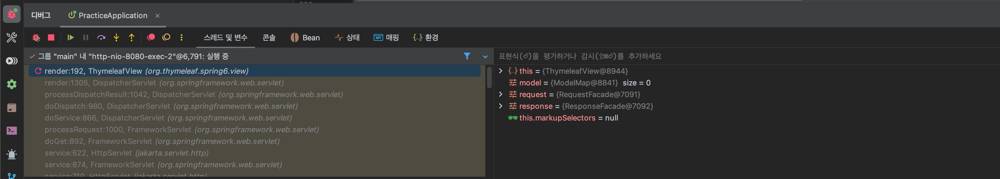
→ ThymeleafView의 render함수 실행
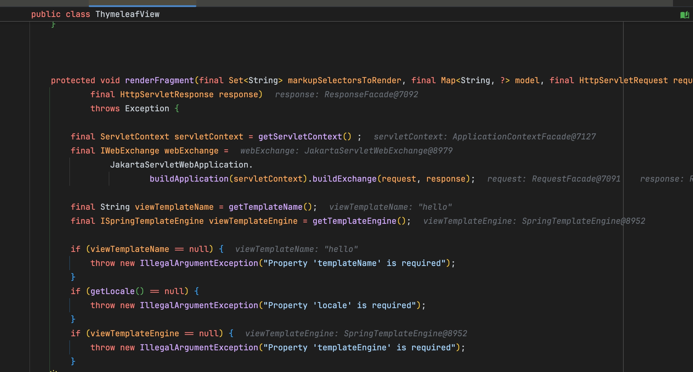
→ 랜더링 기초 작업. 템플릿 이름: “hello”, 템플릿 처리 엔진: “SpringTemplateEngine”

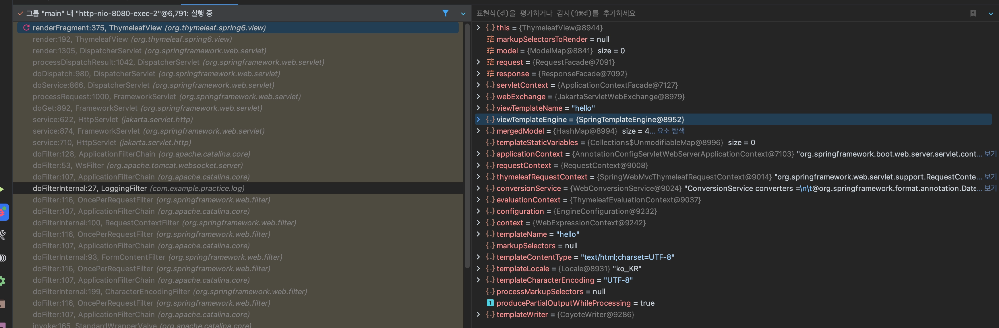
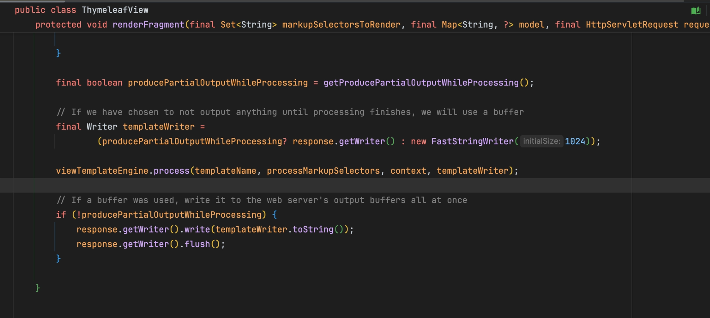
→ process함수를 통해 html응답을 만들고, write()를 통해 완성된 html을 http응답으로 내보낸다.
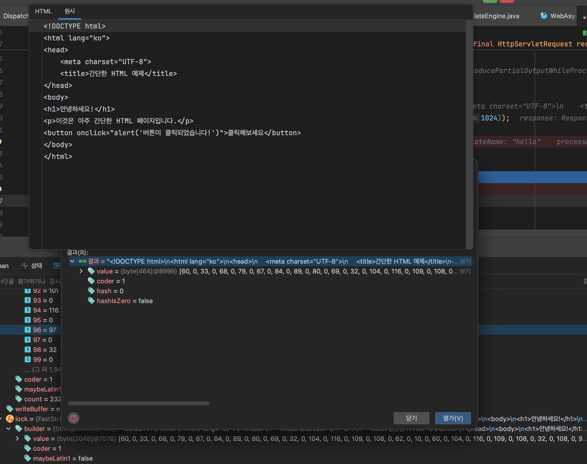
→ process함수가 실행된 뒤, `template.toString()`의 값