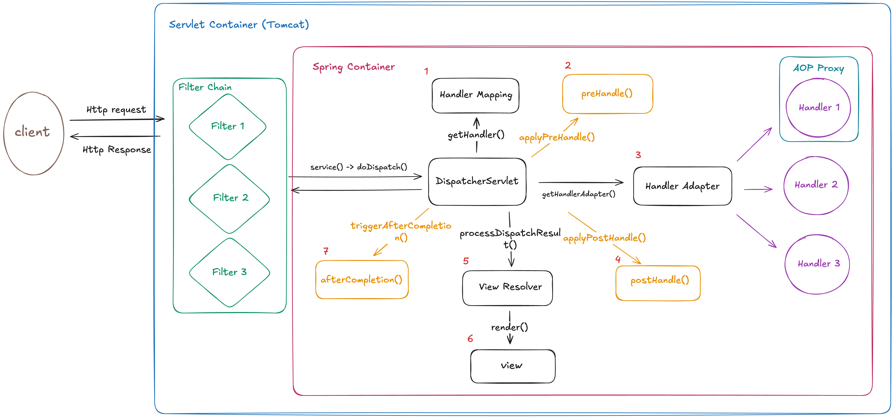
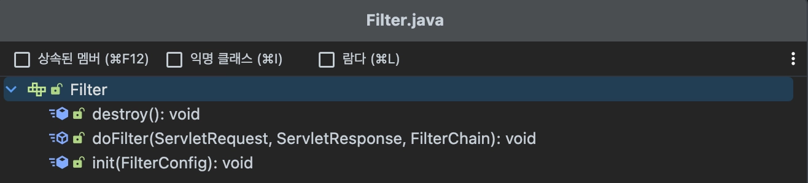
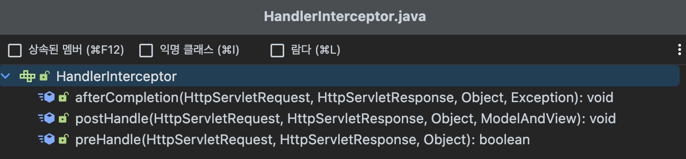

## 클라이언트 요청 흐름

- doDispatch()함수를 기준으로 요청 흐름을 정리해 보았습니다.

# 필터 vs 인터셉터
## 필터 (Filter)

J2EE(자바 표준) 표준 스펙 기능으로 **Dispatcher Servlet**에 요청이 전달되기 전/후에 url 패턴에 맞는 모든 요청에 대해 부가작업을 처리할 수 있는 기능을 제공한다.

필터는 Spring Context이 관리하는 범위가 아닌, 톰캣과 같은 웹 컨테이너(Servlet Container)에 의해 관리되는 것으로, Spring Context의 가장 앞단인 Dispatcher Servlet 전/후에 처리된다.

- Filter 인터페이스를 구현함으로써 필터를 직접 구현할 수 있다.
    - `init` 메서드 → 필터 객체를 초기화하고 서비스에 추가하기 위한 메서드
    - `deFilter` 메서드 → 실제 필터 로직이 실행되는 메서드. 매개변수로 FilterChain을 가지는데, FilterChain의 doFilter메서드를 통해 다음 필터로 이동한다.
    - `destroy` 메서드 → 필터 객체를 서비스에서 제거하고 사용하는 자원을 반환하기 위한 메서드

## 인터셉터 (Interceptor)

Spring이 제공하는 기술로서, Dispatcher Servlet이 컨트롤러를 호출하기 전과 후에 요청과 응답을 참조하거나 가공할 수 있는 기능을 제공한다. 

Dispatcher Servlet에 의해 호출되는 인터셉터는 필터와 달리 Spring Context에서 관리된다.

- HandlerInterceptor 인터페이스를 구현함으로써 인터셉터를 직접 구현할 수 있다.
    - `preHandle` 메서드 → 컨트롤러가 호출되기 이전에 실행되는 메서드. 컨트롤러 이전에 처리해야하는 전처리 작업이나 요청 정보를 가공하는 경우에 사용한다. 리턴 값이 true이면 다음 단계로 지행되지만, False라면 작업을 중단한다.
    - `postHandle` 메서드 → 컨트롤러를 호출한 후에 실행되는 메서드
    - `afterCompletion` 메서드 → 모든 뷰에서 최종 결과를 생성하는 일을 포함해 모든 작업이 완료된 후에 실행되는 메서드

**🧩 Interceptor vs Spring AOP**

**둘 기능 모두 비즈니스 로직 실행 전/후에 실행될 수 있는데** 어떤 차이가 있냐?

→ AOP에서는 **HttpServletRequest/Response** 객체를 얻기 어렵지만 **Interceptor**에서는 파라미터로 쉽게 사용할 수 있다.

1. `httpServletRequest.getSession().getAttribute(”user”)` → 로그인 확인
2. `httpServletRequest.getHeader(”Authorization”)`  → JWT 인증
3. `httpServletRequest.setAttribute(”user”, user)`  → 공통 데이터 세팅

컨트롤러는 타입과 실행 메서드가 모두 제각각이고, 파라미터나 리턴값이 일정하지 않기 때문에 Point cut을 지정하기 힘들다. 따라서, 로직을 넣고자 하는 부분(Join Pont)이 컨트롤러 메서드일 경우에는 Interceptor를 사용하는 편이 낫다.

## ‼️ Filter vs Interceptor

- 예외 처리 여부
    - 필터는 서블릿 영역에서 관리되기 때문에 스프링의 지원을 받을 수 없다. 따라서 만약 필터 로직에서 예외가 발생했어도 처리되지 않은 채 서블릿까지 전달된다.
    - 반면, 인터셉터는 Spring Context내에 존재하기 때문에 예외가 발생하면 올바르게 처리할 수 있다. (@ControllerAdvice)
- Request/Response 객체 변경 가능 여부
    - 필터는 요청, 응답 객체를 다른 객체로 변경해서 넘겨줄 수 있다.
    - 인터셉터는 함수 자체의 리턴값이 없기 때문에 요청 및 응답 객체를 변경하는 것은 불가능하고 내부 값을 활용할 수는 있다. 또한, 객체의 내부 값을 변경할 수 있다.

→ 스프링 기술이 발전하면서 서블릿 필터를 스프링 빈으로 관리할 수 있게 되면서 둘의 차이가 모호해졌다. 하지만 필터는 엄연히 **웹 컨테이너(Servlet Container)**에 의해 관리되고 있기 때문에 맥락상 웹에 관련 것들을 처리하기에 적합하고, 인터셉터는 **Spring Context**에 의해 관리되는 만큼 보통 Spring 기술에 관련된 작업을 한다.

**→ 관심사 분리!**