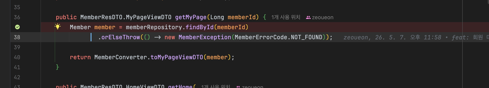
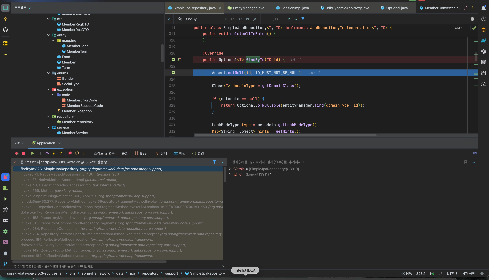
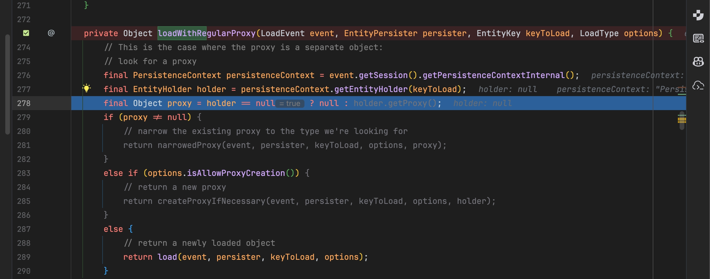
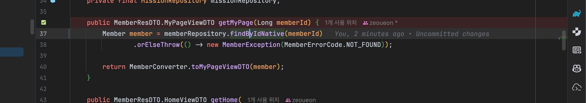
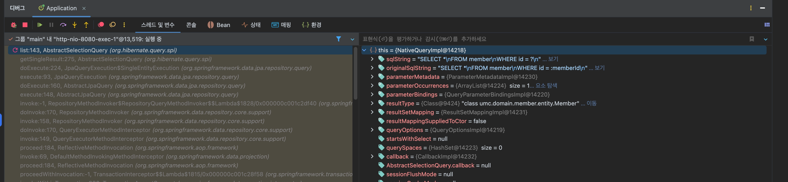

### 간단한 JPA Repository 메서드 실행부분에 디버깅 포인트 찍어보면서 디버깅하기

- 마이페이지 불러오는 API의 findById 호출부분에 디버깅 포인트 찍기

- SimpleJpaRepository의 findById 함수 실행

- holder → null : 1차 캐시에 존재하지 않아서, DB 조회로 가는 상황

### NativeQuery 생성하고 디버깅 포인트 찍어보면서 디버깅하기

- 디버깅을 위해 임의로 native 쿼리 함수로 교체함.

- Native Query의 구현체인 NativeQueryImpl 객체가 SQL 문자열과 바인딩된 파라미터 값을 가지고 있는 것을 확인할 수 있음.